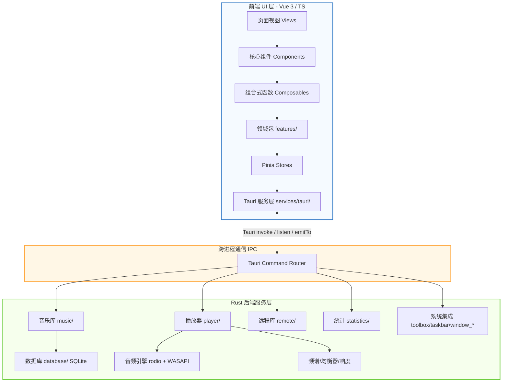

# Lycia Player (XY-Music-Desktop) Code Wiki

> 一款基于 **Tauri v2** 和 **Vue 3** 构建的现代化、高颜值本地音乐播放器，专为 Windows 平台打造。
>
> - **应用名称**：Lycia Player（铃音播放器）
> - **包名**：`lycia-music` / `lycia_music`（Rust crate `my_cloud_music_lib`）
> - **应用标识**：`com.xymusic.desktop`
> - **当前版本**：1.0.1
> - **开源协议**：AGPL-3.0-only
> - **目标平台**：Windows 10 / 11

---

## 目录

- [1. 项目概述](#1-项目概述)
- [2. 技术栈与依赖](#2-技术栈与依赖)
- [3. 项目整体架构](#3-项目整体架构)
- [4. 目录结构总览](#4-目录结构总览)
- [5. 前端模块详解（src/）](#5-前端模块详解src)
  - [5.1 应用入口与多窗口分发](#51-应用入口与多窗口分发)
  - [5.2 路由与页面级组件](#52-路由与页面级组件)
  - [5.3 组件层 components/](#53-组件层-components)
  - [5.4 组合式函数层 composables/](#54-组合式函数层-composables)
  - [5.5 领域包 features/](#55-领域包-features)
  - [5.6 状态管理 stores](#56-状态管理-stores)
  - [5.7 Tauri 服务层 services/tauri/](#57-tauri-服务层-servicestauri)
  - [5.8 持久化与缓存层](#58-持久化与缓存层)
- [6. 后端模块详解（src-tauri/src/）](#6-后端模块详解src-taurisrc)
  - [6.1 入口与运行时装配](#61-入口与运行时装配)
  - [6.2 数据库层 database/](#62-数据库层-database)
  - [6.3 音乐库层 music/](#63-音乐库层-music)
  - [6.4 播放器层 player/](#64-播放器层-player)
  - [6.5 远程音乐库层 remote/](#65-远程音乐库层-remote)
  - [6.6 统计模块 statistics.rs](#66-统计模块-statisticsrs)
  - [6.7 系统集成模块](#67-系统集成模块)
- [7. 跨进程通信（IPC）契约](#7-跨进程通信ipc契约)
- [8. 多窗口架构](#8-多窗口架构)
- [9. 项目运行方式](#9-项目运行方式)
- [10. 构建与发布流程](#10-构建与发布流程)
- [11. 测试体系](#11-测试体系)
- [12. 关键数据结构速查](#12-关键数据结构速查)

---

## 1. 项目概述

Lycia Player 是一款面向 Windows 平台的本地音乐播放器，核心目标是提供**高质量的播放体验、沉浸式歌词显示与深度的系统原生整合**。

**核心功能亮点**：

- **沉浸式 UI**：动态液态网格渐变背景，颜色随专辑封面动态演变；毛玻璃磨砂设计；侧边栏导航 + 抽屉式播放队列。
- **性能优化**：秒开防白屏（启动主题色骨架屏）；路由懒加载；Rust 后端扫描时使用 Semaphore 节流并发，抑制 CPU 突发飙升。
- **系统原生整合**：系统媒体通知控制（SMTC）、Windows 媒体按键、系统托盘、桌面歌词悬浮窗、任务栏播控窗口。
- **全格式歌词**：支持 LRC / 增强型 LRC / ESLRC / QRC（QQ 音乐）/ YRC（网易云）/ LYS / TTML，基于 AMLL 逐字动画渲染。
- **物理整理**：文件夹管理模式、批量重命名预览、外部音频标签编辑器、CUE 整轨解析、无感入库刷新。
- **远程音乐库**：WebDAV 协议远程音乐源接入，安全凭证存储（Windows Credential Manager），LRU 缓存（5GB 上限）。
- **音频高级特性**：10 段均衡器（Biquad peaking filter）、响度归一化（EBU R128 / ReplayGain）、FFT 频谱可视化、WASAPI 独占模式输出。

---

## 2. 技术栈与依赖

### 2.1 前端技术栈

| 类别 | 技术 | 用途 |
| :--- | :--- | :--- |
| 框架 | Vue 3.5（Composition API） | UI 渲染 |
| 语言 | TypeScript 5.6 | 类型安全 |
| 构建 | Vite 6 | 开发服务器与打包 |
| 样式 | Tailwind CSS 4.1 + PostCSS | 原子化 CSS |
| 路由 | Vue Router 4.6 | SPA 路由 |
| 状态 | Pinia 3 | 领域状态管理 |
| 桌面桥 | `@tauri-apps/api` v2 + plugin-dialog/global-shortcut/opener | Tauri IPC |
| 歌词 | `@applemusic-like-lyrics/{core,lyric,vue}` | Apple Music 风格歌词 |
| 图形 | `@pixi/*` v7.4 | 背景液态滤镜（blur/bulge-pinch/color-matrix） |
| 虚拟列表 | `@tanstack/vue-virtual` | 大列表性能 |
| 图标 | `lucide-vue-next` | SVG 图标 |
| 拼音 | `pinyin-pro` | 中文排序 |
| 样式引擎 | `jss` + `jss-preset-default` | 运行时样式 |

### 2.2 后端技术栈（Rust）

| 类别 | Crate | 用途 |
| :--- | :--- | :--- |
| 框架 | `tauri` 2 | 桌面应用壳 |
| 数据库 | `rusqlite` 0.38（bundled） | SQLite 嵌入式数据库 |
| 音频引擎 | `rodio` 0.20（本地化版本） | 音频播放抽象 |
| 解码 | `symphonia` 0.5.5 | 多格式解码（AAC/FLAC/ALAC/MP3/Vorbis/WAV/AIFF） |
| 元数据 | `lofty` 0.21 / `id3` 1.14 | 音频标签读写 |
| 编码 | `encoding_rs` 0.8 | 字符编码降级 |
| 图像 | `image` 0.25 | 封面缩略图生成 |
| HTTP | `reqwest` 0.12（native-tls） | WebDAV / 更新检查 |
| XML | `quick-xml` 0.39 | WebDAV PROPFIND 响应解析 |
| 系统 | `windows-sys` 0.59 | Win32 API（窗口/任务栏/注册表） |
| 音频独占 | `wasapi` 0.23（Windows） | WASAPI 独占模式 |
| 媒体控制 | `souvlaki` 0.7 | 系统媒体传输控制（SMTC） |
| 音频设备 | `cpal` 0.15 | 跨平台音频设备枚举 |
| 频谱 | `rustfft` 6.4 | FFT 计算 |
| 歌词 | `amll-lyric` 0.3 | 多格式歌词解析 |
| 哈希 | `sha2` 0.10 / `hex` 0.4 | 封面哈希 |
| UUID | `uuid` 1.19（v4） | 远程源 ID |
| 凭证 | `keyring` 3（windows-native） | 安全凭证存储 |
| 并发 | `tokio` 1.48（full）/ `rayon` 1.10 | 异步运行时 + 并行迭代 |
| 错误 | `thiserror` 2 | 错误类型派生 |
| 单实例 | `tauri-plugin-single-instance` 2 | 单实例保护 |
| 快捷键 | `tauri-plugin-global-shortcut` 2.3 | 全局快捷键 |
| 窗口状态 | `tauri-plugin-window-state` 2 | 窗口位置记忆 |

### 2.3 本地化的 Rodio

`src-tauri/vendor/rodio-0.20.1/` 是 Rodio 0.20.1 的本地源码副本，通过 `Cargo.toml` 的 `[patch.crates-io]` 覆盖官方 crate。本地化动机：

1. **暴露 `OutputStream::try_from_device`**：允许显式指定 `cpal::Device`，实现设备切换功能（官方未公开）。
2. **特性裁剪**：关闭默认特性，与项目 `symphonia-*` 特性对齐，减小二进制体积。
3. **依赖版本锁定**：与 `cpal = "0.15"`、`symphonia = "0.5.5"` 严格对齐。
4. **针对性补丁**：在不等待上游发版的情况下针对独占模式与 `Sink` 链路做补丁。
5. **平台裁剪**：移除 `wasm-bindgen`、`cpal-shared-stdcxx` 等不需要的平台分支。

---

## 3. 项目整体架构

Lycia Player 采用**前后端分离 + 多窗口同源渲染**架构，通过 Tauri 提供的 IPC 通道进行高性能跨进程通信。



### 3.1 前端分层架构

```
main.ts                      应用启动 / Pinia + Router 注册 / 全局错误处理
  └─ App.vue                 按 window.label 分发到 5 个根组件
      └─ MainShell.vue       主窗口：Sidebar + TitleBar + router-view + PlayerFooter + 模态/Toast
          └─ views/*.vue     6 个路由页面（Home/Favorites/Recent/Artists/Albums/Settings）
              └─ components/*    按 common/headers/home/layout/overlays/player/settings/song-list/statistics 分模块
                  └─ composables/*  useAppShell + player*.ts 系列 + lyrics/ + 各种 use* 桥接
                      └─ features/*/*   领域包：library/playback/collections/settings/statistics/desktopLyrics/...
                          └─ features/*/store.ts + shared/stores/*   Pinia store（共 8 个）
                              └─ services/tauri/*   tauriInvoke + listen + emit + Tauri 窗口 API → Rust 后端
                                  └─ caches/imageCaches.ts   图片/滚动位 LRU+TTL 缓存
```

清晰分出"展示层 → 编排层 → 领域层 → 状态层 → 服务层 → 缓存层"的层级。

### 3.2 后端分层架构

```
main.rs / lib.rs             二进制入口 + Tauri Builder 装配
  └─ app_runtime.rs          setup_app：注册 State / 托盘 / 窗口边界 / 单实例
      ├─ database/           SQLite 单连接 + WAL + 版本化迁移
      ├─ music/              扫描/解析/封面/CUE/歌词/文件管理
      │   └─ scanner/        orchestrator + parser + progress + repository + diff
      ├─ player/             rodio 播放线程 + 命令 + 设备 + 均衡器 + 响度 + 频谱
      │   └─ output/         shared（共享模式）+ wasapi_exclusive（独占模式）
      ├─ remote/             WebDAV 远程库 + 缓存 + 仓储
      ├─ statistics.rs       播放历史与聚合统计
      ├─ toolbox.rs          文件重命名/外部程序/更新检查/GPU 配置
      ├─ taskbar.rs          任务栏播控窗口 Z-order 守护
      ├─ system_fonts.rs     系统字体枚举
      ├─ custom_fonts.rs     自定义歌词字体
      └─ window_*.rs         boundary / material / theme / z_order
```

---

## 4. 目录结构总览

```
XY-Music-Desktop/
├── src/                          # 前端源码（Vue 3 + TS）
│   ├── main.ts                   # 应用入口
│   ├── App.vue                   # 多窗口根分发器
│   ├── App.test.ts
│   ├── router/                   # Vue Router 配置
│   ├── views/                    # 6 个路由页面
│   ├── components/               # 组件库（按域分目录）
│   │   ├── common/               #   通用基础组件
│   │   ├── headers/              #   详情/列表页头部
│   │   ├── home/                 #   首页内部子组件
│   │   ├── layout/               #   应用框架与辅助窗口
│   │   ├── overlays/             #   覆盖层/上下文菜单/模态
│   │   ├── player/               #   播放器核心 UI
│   │   ├── settings/             #   设置页分页与工具箱
│   │   ├── song-list/            #   歌曲列表
│   │   └── statistics/           #   统计页
│   ├── composables/              # 组合式函数
│   │   ├── lyrics/               #   歌词解析器子模块
│   │   ├── player*.ts            #   播放器状态机系列
│   │   ├── useAppShell*.ts       #   主窗口外壳编排
│   │   ├── useDesktopLyrics*.ts  #   桌面歌词窗口
│   │   ├── useKeyboardShortcuts.ts
│   │   ├── useThemeSettings.ts
│   │   └── ...                   #   其他 use* 桥接
│   ├── features/                 # 领域包（store + actions）
│   │   ├── library/              #   音乐库
│   │   ├── playback/             #   播放
│   │   ├── collections/          #   收藏与歌单
│   │   ├── settings/             #   设置
│   │   ├── statistics/           #   统计
│   │   ├── desktopLyrics/        #   桌面歌词共享
│   │   ├── miniPlayer/           #   迷你播放器
│   │   ├── taskbarPlayer/        #   任务栏播放器
│   │   ├── tray/                 #   托盘菜单
│   │   └── lyricsSettings/       #   歌词设置
│   ├── shared/
│   │   └── stores/               # 跨领域 Pinia store（ui, navigation）
│   ├── services/
│   │   ├── tauri/                # Tauri invoke 包装与命令契约
│   │   └── storage/              # localStorage 持久化
│   ├── caches/                   # 前端运行时缓存
│   └── assets/                   # 静态资源
├── src-tauri/                    # 后端源码（Rust + Tauri）
│   ├── src/
│   │   ├── main.rs               # 二进制入口
│   │   ├── lib.rs                # 库入口 + Tauri Builder
│   │   ├── app_runtime.rs        # 应用运行时装配
│   │   ├── database/             # SQLite 数据库层
│   │   ├── music/                # 音乐库层
│   │   │   ├── scanner/          #   扫描子模块
│   │   │   └── fixtures/         #   歌词测试样本
│   │   ├── player/               # 播放器层
│   │   │   └── output/           #   音频输出后端
│   │   ├── remote/               # 远程音乐库层
│   │   ├── statistics.rs         # 统计模块
│   │   ├── toolbox.rs            # 工具箱
│   │   ├── taskbar.rs            # 任务栏窗口
│   │   ├── system_fonts.rs       # 系统字体
│   │   ├── custom_fonts.rs       # 自定义字体
│   │   ├── error.rs              # 错误类型
│   │   ├── foreground_window.rs  # 前台窗口检测
│   │   └── window_*.rs           # 窗口相关（boundary/material/theme/z_order）
│   ├── vendor/rodio-0.20.1/      # 本地化的 Rodio 源码
│   ├── capabilities/             # Tauri 权限配置
│   ├── permissions/              # 自定义命令权限
│   ├── icons/                    # 应用图标（多平台多分辨率）
│   ├── tests/                    # Rust 集成测试
│   ├── Cargo.toml / Cargo.lock
│   ├── tauri.conf.json           # Tauri 应用配置
│   └── build.rs                  # 构建脚本
├── scripts/                      # Node.js 脚本
│   ├── sync-version.js           # 版本号同步
│   ├── check-version.js          # 版本号校验
│   └── build-releases.js         # 多目标构建
├── public/                       # 前端公共资源
├── screenshots/                  # 截图
├── package.json
├── vite.config.ts
├── eslint.config.js
├── postcss.config.js
├── index.html
├── LICENSE / NOTICE
└── README.md / README_EN.md
```

---

## 5. 前端模块详解（src/）

### 5.1 应用入口与多窗口分发

#### `src/main.ts` —— 应用启动入口

职责：
1. **导入样式**：`./style.css`（Tailwind 全局）+ `@applemusic-like-lyrics/core/style.css`（歌词组件）。
2. **启动主题预绘制**：调用 `shouldApplyStartupThemePaint(currentWindowLabel)` + `applyPersistedStartupTheme()`，在主窗口挂载前同步应用持久化的启动主题色，避免白屏闪烁。
3. **获取窗口标签**：`getCurrentWindow().label`，try/catch 容错回退到 `'main'`。
4. **注册插件**：`createPinia()` + `router`。
5. **全局错误处理**：`app.config.errorHandler` + `window.addEventListener('error' / 'unhandledrejection')` + `try/catch` 包裹 `app.mount('#app')`，统一调用 `showFatalError()` 在 `#app` 容器内渲染错误卡片，并把错误信息写入 `localStorage['lycia_last_fatal_error']`。
6. **禁用右键**：`document.addEventListener('contextmenu', e => e.preventDefault())`。

#### `src/App.vue` —— 多窗口根分发器

本身不渲染业务 UI，仅根据当前窗口 label 选择对应根组件：

```vue
<template>
  <DesktopLyricsWindow v-if="isDesktopLyricsWindow" />
  <MiniPlayerWindow v-else-if="isMiniPlayerWindow" />
  <TrayMenuWindow v-else-if="isTrayMenuWindow" />
  <TaskbarControlWindow v-else-if="isTaskbarPlayerWindow" />
  <MainShell v-else />
</template>
```

其他职责：
- **自定义歌词字体注册**：监听 `settings.customLyricsFonts` 变化，调用 `registerImportedLyricsFonts`。
- **关闭到托盘**：仅主窗口注册 `onCloseRequested`，根据 `settings.closeToTray` 决定隐藏到托盘还是真退出。
- **全局 user-select 样式**：禁用文本选择，仅对 `input/textarea/[contenteditable]` 开放。

### 5.2 路由与页面级组件

#### `src/router/index.ts` —— 路由配置

```ts
const routes: Array<RouteRecordRaw> = [
  { path: '/',          name: 'Home',      component: Home,      meta: { keepAlive: true } },
  { path: '/favorites', name: 'Favorites', component: Favorites },
  { path: '/recent',    name: 'Recent',    component: Recent },
  { path: '/artists',   name: 'Artists',   component: Artists },
  { path: '/albums',    name: 'Albums',    component: Albums },
  { path: '/settings',  name: 'Settings',  component: Settings },
];
```

#### `src/views/` —— 6 个页面级组件

全部采用路由懒加载：
- `Home.vue` —— 首页（含本地音乐、文件夹、艺术家、专辑、歌单、统计入口），`keepAlive: true`。
- `Favorites.vue` —— 收藏页（歌曲/艺术家/专辑 tab）。
- `Recent.vue` —— 最近播放（歌曲/专辑/歌单 tab）。
- `Artists.vue` —— 艺术家浏览页。
- `Albums.vue` —— 专辑浏览页。
- `Settings.vue` —— 设置页。

> 注：vue-router 中的 6 条路由只是"主导航页面"。`Home.vue` 内部通过 `currentViewMode`（`useNavigationStore`，取值 `'all' | 'folder' | 'artist' | 'album' | 'playlist' | 'recent' | 'favorites' | 'statistics'`）切换 Home 内部的子视图（HomeViewPane），不切换路由。

### 5.3 组件层 components/

#### `common/` —— 通用基础组件（8 个）

| 组件 | 职责 |
| :--- | :--- |
| `DragGhost.vue` | 拖拽时的悬浮幽灵预览（拖歌曲到文件夹/歌单） |
| `FavoritesGrid.vue` | 收藏网格卡片（艺术家/专辑网格） |
| `FolderTreeItem.vue` | 文件夹树节点（递归渲染 `FolderNode.children`） |
| `ModernInputModal.vue` | 现代化输入对话框（新建文件夹/歌单/重命名） |
| `ModernModal.vue` | 通用确认/警告模态框（支持 `type="danger"`） |
| `QualityBadge.vue` | 歌曲质量徽章（Hi-Res / 无损 / 高品质） |
| `SortModeIcon.vue` | 排序模式下拉指示器 |
| `Toast.vue` | 全局 toast 通知（由 `useToast` 控制） |

#### `headers/` —— 详情/列表页头部（7 个）

`DetailHeader.vue`（基类）、`AlbumDetailHeader.vue`、`ArtistDetailHeader.vue`、`FavoritesHeader.vue`、`LocalMusicHeader.vue`、`RecentHeader.vue`、`FoldersHeader.vue`。

#### `home/` —— 首页内部子组件（5 个）

`HomeViewPane.vue`（主视图容器）、`HomeContentPanel.vue`、`HomeHeaderPanel.vue`、`HomeEmptyState.vue`、`ArtistAlbumGrid.vue`。

#### `layout/` —— 应用框架与辅助窗口

| 组件 | 职责 |
| :--- | :--- |
| `MainShell.vue` | **主窗口外壳**：全局背景 + 启动遮罩 + 外部拖拽覆盖层 + 扫描进度卡片 + Sidebar + TitleBar + `<router-view>` + PlayerFooter + PlayQueueSidebar + 模态/Toast。通过 `useAppShell()` 拉取全部外壳状态。 |
| `Sidebar.vue` / `SidebarBrand.vue` / `SidebarNavigation.vue` / `SidebarPlaylists.vue` | 侧边栏品牌区/导航区/歌单区 |
| `TitleBar.vue` | 自定义标题栏（最小化/最大化/关闭、前进/后退） |
| `PlayerFooter.vue` | 底部播放控制条（进度条 + 播放/上下首/模式/音量） |
| `GlobalBackground.vue` | 全局背景层（流光/纯色/壁纸/Mica 材质） |
| `MiniPlayerWindow.vue` | 迷你播放器窗口根组件（label=`mini-player`） |
| `TrayMenuWindow.vue` | 托盘菜单窗口根组件（label=`tray-menu`） |
| `TaskbarControlWindow.vue` | 任务栏播放控制器窗口根组件（label=`taskbar-player`） |

配套工具：`playerFooterProgress.ts`（进度条数学）、`windowMaterial.ts`（窗口材质常量）。

#### `overlays/` —— 覆盖层/上下文菜单/模态（10 个）

- 模态：`AddToPlaylistModal.vue`、`ConfirmModal.vue`、`MoveToFolderModal.vue`、`SongInfoModal.vue`、`RenamePreviewModal.vue`、`CustomSkinModal.vue`、`SponsorModal.vue`。
- 上下文菜单：`SongContextMenu.vue`、`PlaylistContextMenu.vue`、`FolderContextMenu.vue`、`FooterContextMenu.vue`。
- 状态机：`folderContextMenuState.ts`。

#### `player/` —— 播放器核心 UI（16 个）

| 组件 | 职责 |
| :--- | :--- |
| `PlayerDetail.vue` | 全屏播放详情页（含 `PlayerDetailBackground.vue` 模糊背景 + `PlayerDetailLeft.vue` 左侧封面区） |
| `LyricsView.vue` | 主窗口歌词视图（普通模式） |
| `AmlLyricPlayer.vue` | 基于 `@applemusic-like-lyrics/vue` 的 Apple Music 风格歌词播放器（高级模式） |
| `LightLyricPlayer.vue` | 轻量歌词播放器 |
| `AudioVisualizer.vue` | 音频频谱可视化（基于 `get_audio_visualizer_samples` 命令） |
| `EqualizerPanel.vue` | 10 段均衡器面板 |
| `PlayQueueSidebar.vue` | 播放队列侧栏 |
| `QueueList.vue` | 队列列表 |
| `DesktopLyricsWindow.vue` | 桌面歌词独立窗口根组件（label=`desktop-lyrics`） |
| `DesktopLyricsToolbar.vue` | 桌面歌词悬浮工具条 |

配套工具：`amllSeekLayout.ts`、`audioVisualizerMath.ts`、`lightLyricPlayerModel.ts`。

#### `settings/` —— 设置页分页与工具箱（17 个）

`SettingsGeneral.vue`、`SettingsLibrary.vue`、`SettingsRemoteLibrary.vue`、`SettingsTheme.vue`、`SettingsAudioOutput.vue`、`SettingsDesktopLyrics.vue`、`SettingsShortcuts.vue`、`SettingsSidebar.vue`、`SettingsAbout.vue`、`SettingsToolbox.vue` + `ToolboxStep1~4.vue` + `ToolboxStepIndicator.vue`、`CustomSkinModal.vue`、`RenamePreviewModal.vue`、`SponsorModal.vue`。

#### `song-list/` —— 歌曲列表（3 个）

`SongTable.vue`（基于 `@tanstack/vue-virtual` 虚拟滚动）、`SongList.vue`、`MasterPanel.vue`。

#### `statistics/` —— 统计页（6 个）

`StatisticsPage.vue`、`StatsOverviewCards.vue`、`BehaviorStatsSection.vue`、`FormatPieChart.vue`、`QualityPieChart.vue`、`StatisticsImportDialog.vue`。

### 5.4 组合式函数层 composables/

#### 5.4.1 player*.ts 系列 —— 播放器状态管理

该系列采用"**工厂函数 + 依赖注入**"模式：每个 `player*.ts` 导出 `createPlayerXxx(deps)` 工厂，由 `playerCore.ts` 在内部按顺序组装并相互注入依赖；最终通过模块级单例 `playerCore` 暴露。

##### `playerCore.ts` —— 总装中心（最关键）

```ts
function createPlayerCore() { /* 内部依次创建并相互注入各子模块 */ }
let playerCore: ReturnType<typeof createPlayerCore> | null = null;
export function usePlayerCore() {
  if (!playerCore) playerCore = createPlayerCore();
  return playerCore;
}
```

职责：
- 在 `createPlayerCore()` 内部依次创建并相互注入：`createPlayerPlaylist`、`createPlayerHistoryFavorites`、`useCollectionsActions`、`createPlayerFileManager`、`createPlayerLibraryManager`、`createPlayerFolderTree`、`createPlayerFolderImport`、`createPlayerUiShell`、`usePlaybackActions`、`createPlayerLibraryRuntime`、`createPlayerRestore`、`createPlayerPersistence`、`createPlayerLifecycle`、`createPlayerQueue`、`createPlayerPlayback`、`useLibrarySync`、`useFileImport`、`useWindowActions`。
- 通过 `storeToRefs` 接入所有 Pinia store。
- 集成 `usePlayerLibraryView` 派生出 `artistList/albumList/folderList/currentViewSongs` 等视图。
- 返回分域 API：`state`、`views`、`lifecycle`、`appShellDomain`、`libraryDomain`、`collectionsDomain`、`playbackDomain`、`windowDomain`、`sortingDomain`，以及 `legacyApi`（供老代码消费）。

##### `player.ts` —— 兼容包装

```ts
export function usePlayer() {
  return usePlayerCore().legacyApi;
}
```

##### `playerPlayback.ts` —— 播放引擎桥接

工厂签名：`createPlayerPlayback({ getDisplaySongList, addToHistory, loadLyrics, handleAutoNext, onBeforePlay })`

核心方法：`playSong(song, options)`（队列构建、封面预加载、CUE 偏移、调用 `playbackApi.playAudio`、启动播放时钟）、`pauseSong`、`togglePlay`、`seekTo`、`playAt`、`handleSeek`、`stepSeek`、`handleSeekCompleted`、`stopPlaybackRuntime`、`flushPlaySession`（统计 `record_play` 上报）。

通过 `requestAnimationFrame` 推进 `currentTime`，主窗口低功耗时降为 `setTimeout`（`LOW_POWER_PROGRESS_UPDATE_MS = 1000`），每秒与 `playbackApi.getPlaybackProgress()` 同步。

##### `playerQueue.ts` —— 队列与播放模式

工厂签名：`createPlayerQueue({ playSong, stopPlaybackRuntime, showToast })`

维护 `shuffleHistory` / `shuffleFuture` 两个长度上限 256 的栈。关键方法：`nextSong`、`prevSong`、`clearQueue`、`addSongToQueue`、`addSongsToQueue`、`removeSongFromQueue`、`toggleMode`（playMode 0/1/2 = 列表循环/单曲循环/随机）、`playNext`、`resetShuffleState`。

##### 其他 player*.ts

| 文件 | 职责 |
| :--- | :--- |
| `playerPlaylist.ts` | 歌单 CRUD 委托（转发到 `useLibraryCollections`） |
| `playerFileManager.ts` | 文件/文件夹操作（删除/移动/刷新/归档路径生成） |
| `playerLibraryManager.ts` | 音乐库文件夹增删与外部路径处理 |
| `playerPersistence.ts` | 持久化防抖写入（200ms 防抖） |
| `playerLifecycle.ts` | 应用生命周期与 Tauri 事件监听 |
| `playerLibraryBatch.ts` | 库扫描批量更新合并/冲刷 |
| `playerLibraryRuntime.ts` | 库扫描运行时（`scanLibrary`、`bootstrapLibrary`） |
| `playerLibraryScan.ts` | 扫描选项解析 |
| `playerRestore.ts` | 启动时从 localStorage 恢复状态 |
| `playerFolderTree.ts` | 文件夹树拉取/创建/展开 |
| `playerFolderImport.ts` | 文件夹导入流程 |
| `playerHistoryFavorites.ts` | 收藏/历史管理 |
| `playerUiShell.ts` | UI 外壳行为（音量、静音、扫描等） |

#### 5.4.2 useAppShell.ts —— 主窗口外壳总编排器

```ts
export function useAppShell() {
  // 1. 从 usePlayer() 拉取播放/库状态
  // 2. useAddToPlaylistDialog() —— 加入歌单对话框
  // 3. useAppThemeSync() —— 主题/窗口材质同步
  // 4. useAppShellTheme({ ... }) —— 计算背景模糊样式
  // 5. useRoute/useRouter + useUiStore
  // 6. usePlayerViewState() + usePlayerLibraryView()
  // 7. useMainWindowRenderingPower() —— 主窗口渲染功耗档位
  // 8. prepareStartupTransparentComposition / finishStartupTransparentComposition
  // 9. useExternalPathBridge({ ... }) —— 外部路径拖入桥
  // 10. useHomeRouteSync()
  // 11. useMiniPlayerWindowBridge() / useTaskbarPlayerBridge()
  //     useKeyboardShortcuts() / useTrayMenuEvents(router)
  // 12. init() —— 启动播放器生命周期
  return { /* 大量状态与回调 */ };
}
```

#### 5.4.3 lyrics/ 子目录 —— 歌词解析器

入口：`index.ts` 重新导出 `types/constants/fontUtils/parser/classifier/converters/compat/state`。

##### `parser.ts` —— 多格式歌词解析核心

- 使用 `@applemusic-like-lyrics/lyric/pkg/amll_lyric.js` 的 WASM 解析器：`parseLrc`、`parseEslrc`、`parseYrc`、`parseQrc`、`parseLys`、`parseTTML`、`decryptQrcHex`。
- 支持的源格式：`lrc`、`enhanced_lrc`、`eslrc`、`yrc`、`qrc`、`lys`、`ttml`。
- 优先级表 `PARSER_PRIORITIES`：`enhanced_lrc > ttml > yrc > qrc > lys > eslrc > lrc`。
- 关键导出：`parseTimestampToMs`、`isEnhancedLrcLine`、`parseEnhancedLrcLine`、`parseEnhancedLrc`、`mergeEnhancedLinesIntoBaseLines`、`sanitizeLineText`、`sanitizeWordText`、`normalizeEslrcSource`、`parseWithAml`、`prepareParsedLyrics`。
- `parseWithBestCandidate(raw)` 并行尝试多种解析器并按 `scoreParsedLines` 排序选最优。
- `prepareParsedLyrics(raw)` 输出归一化的 `ParsedLine[]`。

##### `types.ts` —— 歌词类型定义

`LyricLine`、`LyricWord`、`LyricsPayload`、`LyricDocument`、`SemanticLine`、`ParsedLine`、`ParsedWord`、`ParsedLineSourceFormat`、`ExplicitLineRole`（`'translation' | 'roman'`）、`LyricTrackRole`、`LyricTimingMode`、`DominantScript`、`ClassificationConfidence`（`'explicit' | 'parser-native' | 'heuristic'`）。

##### 其他 lyrics 子文件

| 文件 | 职责 |
| :--- | :--- |
| `classifier.ts` | 行角色分类（主歌词/翻译/罗马音/二级） |
| `compat.ts` | 兼容旧格式转换 |
| `constants.ts` | 默认设置（`createDefaultLyricsSettings`、`mergeLyricsSettings`、`normalizeImportedLyricsFonts`） |
| `converters.ts` | 解析结果到 `LyricLine[]` 的转换 |
| `fontUtils.ts` | 歌词字体工具 |
| `state.ts` | 歌词运行时状态 |

#### 5.4.4 其他重要 composables

| 文件 | 职责 |
| :--- | :--- |
| `useKeyboardShortcuts.ts` | 本地 + 全局快捷键（9 个 `ShortcutActionId`） |
| `useDesktopLyricsWindowController.ts` | 桌面歌词窗口控制器（居中/自动隐藏/锁定/拖拽/Z-order） |
| `useDesktopLyricsWindowBridge.ts` | 主窗口 ↔ 桌面歌词窗口桥 |
| `useDesktopLyricsDisplay.ts` | 桌面歌词显示逻辑 |
| `useMiniPlayerWindowBridge.ts` | 主窗口 ↔ 迷你播放器桥 |
| `useTaskbarPlayerBridge.ts` | 主窗口 ↔ 任务栏播放器桥 |
| `useTrayMenuEvents.ts` | 托盘菜单事件分发 |
| `useWindowActions.ts` | 窗口操作（最小化、置顶、显示桌面歌词等） |
| `useThemeSettings.ts` | 主题模式切换/补丁更新 |
| `useAppThemeSync.ts` | 与 Rust 侧同步主题 |
| `useExternalPathBridge.ts` | 外部路径拖入/打开桥 |
| `useCoverCache.ts` | 封面缓存与预加载 |
| `useHomeRouteSync.ts` 等 | Home 视图相关 8 个 composable |
| `usePlayerViewState.ts` | 当前视图状态 |
| `useSongContextActions.ts` 等 | 歌曲右键/拖拽/信息/缓存/字母索引 5 个 |
| `useSidebarPlaylist*.ts` | 侧边栏歌单交互四件套 |
| `useScopedBatchSelection.ts` | 批量选择 |
| `useListScrollMemory.ts` | 列表滚动位置记忆 |
| `useConcurrentScheduler.ts` | 并发任务调度 |
| `colorExtraction.ts` | 封面主色提取（`extractDominantColors`） |
| `preblurredBackgroundCache.ts` | 预模糊背景缓存 |
| `renderingPower.ts` | 主窗口低功耗模式检测 |
| `dragState.ts` | 拖拽会话状态 |
| `toast.ts` | `useToast()` 全局 toast |
| `playbackCleanup.ts` | 播放状态清理 |
| `libraryRemovalCleanup.ts` | 库移除时的级联清理 |
| `startupCompositionMask.ts` 等 | 启动期间遮罩与首次重绘 3 个 |
| `windowMaterial.ts` | 窗口材质（Mica/Acrylic/Blur）相关 |
| `useLibrary*SongPathCache.ts` | 4 个不同视图的歌曲路径缓存 |

### 5.5 领域包 features/

`features/` 是按业务领域划分的"**模块化领域包**"，每个子目录通常包含 `store.ts`（Pinia store）+ 若干 composable/action 文件。状态从 `composables/` 中抽离到 `features/*/store.ts`，composables 只负责编排。

#### `library/` —— 音乐库领域

- `store.ts` —— `useLibraryStore`（id=`'library'`），最复杂的 store，采用**路径数组 + SongPool Map + 字符串/数组 intern 池**优化大型库内存与响应式开销。
- `usePlayerLibraryView.ts` —— 编排视图选择器（被 `playerCore` 使用）。
- `useLibrarySync.ts` —— 库文件夹增删/外部路径处理 + toast。
- 其他：`useLibraryBrowse.ts`、`useLibraryCatalogSelectors.ts`、`useLibraryCollectionSelectors.ts`、`useLibraryCurrentViewSongs.ts`、`useLibraryFolderSelectors.ts`、`useLibraryRuntimeActions.ts`、`useSongTableLibraryState.ts`、`playerLibraryViewShared.ts`。

#### `playback/` —— 播放领域

- `store.ts` —— `usePlaybackStore`（id=`'playback'`）。
- `usePlaybackActions.ts` —— 封装 playerPlayback/playerQueue/playerUiShell。
- `usePlaybackController.ts` —— 统一对外暴露 playback domain 给 UI 组件。

#### `collections/` —— 收藏与歌单领域

- `store.ts` —— `useCollectionsStore`（id=`'collections'`），管理 `favoritePaths`、`playlists`、`recentSongs`（限 200 条）、`playlistSortMode`。
- `useLibraryCollections.ts` —— 对 store 的封装 + 与导航/历史 API 联动。
- `useCollectionsActions.ts` —— 工厂 `useCollectionsActions({ playerPlaylist, playerHistoryFavorites })`。
- `addToPlaylistDialog.ts` —— `useAddToPlaylistDialog()` 模块级单例。

#### `settings/` —— 设置领域

- `store.ts` —— `useSettingsStore`（id=`'settings'`），持有 `settings: AppSettings`。
- `useSettings.ts` —— 带 legacy 迁移与持久化恢复。
- `restore.ts` —— 启动恢复。
- `shortcuts.ts` —— 快捷键默认值与匹配工具（`shortcutActionOrder`、`matchesShortcutEvent`、`toGlobalShortcutAccelerator`）。

#### `statistics/` —— 统计领域

- `store.ts` —— `useStatisticsStore`（id=`'statistics'`），直接 `invoke('get_library_stats'/'get_behavior_stats'/'get_quality_distribution'/'get_format_distribution')`，含 60s 离开释放重数据机制。

#### 其他 features 子模块

- `desktopLyrics/shared.ts` —— 桌面歌词窗口的常量、事件名、类型与几何工具（`DESKTOP_LYRICS_WINDOW_LABEL = 'desktop-lyrics'`、`_DEFAULT_WIDTH = 900`、`_DEFAULT_HEIGHT = 280`、`_EDGE_SNAP_THRESHOLD = 24`、9 个事件名、`DesktopLyricsWindowSettings` 等）。
- `miniPlayer/shared.ts` —— `MINI_PLAYER_WINDOW_LABEL = 'mini-player'`、`_WIDTH = 300`、`_BASE_HEIGHT = 75`、`_EXPANDED_HEIGHT = 420`、`_VOLUME_HEIGHT = 135`。
- `taskbarPlayer/shared.ts` —— `TASKBAR_PLAYER_WINDOW_LABEL = 'taskbar-player'`、`_WIDTH = 320`、`_HEIGHT = 40`。
- `tray/actions.ts` —— `TRAY_MENU_WINDOW_LABEL = 'tray-menu'`、`TrayMenuAction`、`handleTrayMenuAction(action, deps)`。
- `lyricsSettings/store.ts` —— 歌词设置 store。

### 5.6 状态管理 stores

项目使用 **Pinia 3**，store 分散在 `features/*/store.ts` 与 `shared/stores/`。`main.ts` 中 `app.use(createPinia())` 注册。所有 store 均使用 **Setup Store**（`defineStore(id, () => { ... })`）写法。共 **8 个 Pinia store**：

| Store | id | 文件 | 职责 |
| :--- | :--- | :--- | :--- |
| `useUiStore` | `'ui'` | `shared/stores/ui.ts` | `showPlaylist`、`showPlayerDetail`、`showQueue`、`isMiniMode`、`skipNextPageTransition`、`startupCompositionMaskVisible`、`dominantColors` |
| `useNavigationStore` | `'navigation'` | `shared/stores/navigation.ts` | `currentViewMode`、`filterCondition`、`searchQuery`、`currentArtistFilter`、`currentAlbumFilter`、`currentFolderFilter` 等 |
| `useLibraryStore` | `'library'` | `features/library/store.ts` | 最复杂的 store：`songPool` Map、路径数组、Catalog、库元数据、排序状态 |
| `usePlaybackStore` | `'playback'` | `features/playback/store.ts` | `isPlaying`、`volume`、`currentTime`、`playMode`、`currentSong`、`playQueuePaths`、`tempQueuePaths`、启动协调 |
| `useCollectionsStore` | `'collections'` | `features/collections/store.ts` | `favoritePaths`、`playlists`、`recentSongs` |
| `useSettingsStore` | `'settings'` | `features/settings/store.ts` | `settings: AppSettings`（含 closeToTray、lyrics、theme、sidebar、shortcuts、audio、organizeRule 等） |
| `useStatisticsStore` | `'statistics'` | `features/statistics/store.ts` | 统计数据加载与释放 |
| `useLyricsSettingsStore` | `'lyricsSettings'` | `features/lyricsSettings/store.ts` | 歌词设置 |

### 5.7 Tauri 服务层 services/tauri/

#### `invoke.ts` —— 类型化 invoke 包装

```ts
import { invoke } from '@tauri-apps/api/core';
import type { TauriCommandMap } from './contracts';

export const tauriInvoke = <K extends keyof TauriCommandMap>(
  command: K,
  payload?: TauriCommandMap[K]['payload'],
) => invoke<TauriCommandMap[K]['response']>(command, payload as Record<string, unknown> | undefined);
```

#### `contracts.ts` —— 全部命令的类型契约

定义 `TauriCommandMap`（180+ 条命令的 payload/response 类型签名），以及 DTO 接口：`AudioDevice`、`AudioOutputStatus`、`MovedMusicFilePath`、`BatchMoveMusicFilesResult`、`LyricsStorageSource`、`SongLyricsForEdit`、`SongInfoEditPayload`、`SaveSongInfoResponse`、`RecentHistoryRecord`、`StatisticsExportResult/Preview/Result`、`LoudnessRecord`、`PlayAudioOptions`、`UpdateLoudnessSettingsOptions`、`UpdatePlaybackMetadataOptions`、`SeekAudioOptions`、`WindowMaterialCapabilities`、`ForegroundFullscreenState`。

#### API 模块（按领域拆分）

| 文件 | 职责 |
| :--- | :--- |
| `appApi.ts` | 应用级命令 |
| `fileApi.ts` | 文件操作（`deleteFolder`、`moveFileToFolder`、`batchMoveMusicFiles`、`scanMusicFolder` 等） |
| `libraryApi.ts` | 库文件夹与层级（`getLibraryFolders`、`getLibraryHierarchy`、`addLibraryFolder` 等） |
| `playbackApi.ts` | 播放相关 + 均衡器（含 `createEqualizerSignature`、并发调度 + 50ms 节流的 `requestEqualizerSettings` / `flushEqualizerSettings`） |
| `historyApi.ts` | 历史相关（含 `removeSongsFromHistoryAndStatistics`） |
| `statisticsApi.ts` | 统计导入/导出/预览 |
| `remoteLibraryApi.ts` | 远程音乐库（WebDAV） |
| `windowApi.ts` | 窗口材质、置顶守卫、全屏检测 |

### 5.8 持久化与缓存层

#### `services/storage/` —— localStorage 持久化

- `localStore.ts` —— localStorage 包装。
- `playerStorage.ts` —— 播放器状态持久化（`writePlayerState`、`readPlayerState`，含 EQ 设置）。

#### `caches/imageCaches.ts` —— 图片 LRU + TTL 缓存

基于 `utils/MemoryCache.ts`，导出：

```ts
export const artistHeaderCache = new MemoryCache<string, string>({ maxEntries: 32, ttlMs: 10 * 60 * 1000 });
export const albumHeaderCache  = new MemoryCache<string, string>({ maxEntries: 32, ttlMs: 10 * 60 * 1000 });
export const sidebarPlaylistCoverCache = new MemoryCache<string, string>({ maxEntries: 80, ttlMs: 24 * 60 * 60 * 1000 });
export const listScrollCache = new MemoryCache<string, number>({ maxEntries: 30, ttlMs: 30 * 60 * 1000 });
export const artistViewportCoverSnapshotCache = new MemoryCache<string, ViewportCoverUrlSnapshot>({ maxEntries: 1, ttlMs: 10 * 60 * 1000 });
export const albumViewportCoverSnapshotCache  = new MemoryCache<string, ViewportCoverSnapshot>({ maxEntries: 1, ttlMs: 10 * 60 * 1000 });
export const songTableViewportCoverSnapshotCache = new MemoryCache<string, ViewportCoverSnapshot>({ maxEntries: 12, ttlMs: 10 * 60 * 1000 });
```

- `pruneImageCaches()` / `clearImageCaches()`。
- 注册 `document.addEventListener('visibilitychange', ...)`：页面 hidden 时自动 `pruneImageCaches()`。

---

## 6. 后端模块详解（src-tauri/src/）

### 6.1 入口与运行时装配

#### `main.rs` —— 二进制入口

```rust
#![cfg_attr(not(debug_assertions), windows_subsystem = "windows")]  // Release 隐藏控制台

fn main() {
    my_cloud_music_lib::run()
}
```

#### `lib.rs` —— 库入口 + Tauri Builder 装配

`run()` 启动流程：
1. **GPU 启动控制**（Windows）：`should_disable_gpu_for_startup()` 检查 `%APPDATA%\com.xymusic.desktop\gpu_config.json`，若禁用则 `append_webview2_browser_arg("--disable-gpu")`。
2. **Tauri Builder** 装配，注册插件：
   - `tauri_plugin_single_instance`：单实例保护，第二实例参数经 `handle_single_instance` 转发。
   - `tauri_plugin_window_state`：窗口状态持久化（denylist 排除 4 个辅助窗口）。
   - `tauri_plugin_dialog` / `tauri_plugin_opener` / `tauri_plugin_global_shortcut`。
3. **`on_window_event`**：主窗口 `Destroyed` 时 `exit(0)`。
4. **`setup`**：调用 `app_runtime::setup_app(app)`。
5. **`invoke_handler`**：注册 100+ 个 Tauri 命令（详见第 7 节）。

#### `app_runtime.rs` —— 应用运行时装配

```rust
pub(crate) fn setup_app(app: &mut tauri::App<tauri::Wry>) -> Result<(), Box<dyn std::error::Error>> {
    app.manage(PendingOpenPaths::default());
    let db_state = DbState::new(app.handle())?;
    app.manage(db_state);
    let player_state = init_player(app.handle());
    app.manage(player_state);
    app.manage(ThumbnailImageConcurrencyLimit(Semaphore::new(THUMBNAIL_IMAGE_CONCURRENCY_LIMIT)));
    app.manage(FullCoverImageConcurrencyLimit(Semaphore::new(FULL_COVER_IMAGE_CONCURRENCY_LIMIT)));
    run_cache_cleanup(app.handle());
    let initial_open_paths = collect_existing_open_paths(std::env::args().skip(1), current_exe.as_deref());
    queue_open_paths(app.handle(), initial_open_paths);
    install_window_boundary(app);
    build_tray(app)?;
    Ok(())
}
```

集中初始化所有 `tauri::State`：`PendingOpenPaths`、`DbState`、`PlayerState`、两个并发限制信号量（缩略图与全图）。处理单实例启动时传入的文件路径。安装窗口边界钩子与系统托盘。

#### 关键常量

- `THUMBNAIL_IMAGE_CONCURRENCY_LIMIT` / `FULL_COVER_IMAGE_CONCURRENCY_LIMIT` —— 封面并发处理上限。
- `APP_SHOW_MAIN_EVENT = "app:show-main"`、`APP_TRAY_MENU_OPEN_EVENT = "app:tray-menu-open"`。
- `MAIN_WINDOW_LABEL = "main"`、`MINI_PLAYER_WINDOW_LABEL = "mini-player"`。

### 6.2 数据库层 database/

#### `state.rs` —— DbState 状态管理

```rust
pub struct DbState {
    pub conn: Arc<Mutex<rusqlite::Connection>>,
}
```

- 数据库文件位于 Tauri 的 `app_data_dir`，命名为 `library.db`。
- 通过 `Arc<Mutex<rusqlite::Connection>>` 提供线程安全的单一连接池。
- 启动时调用 `schema::ensure_base_schema(&conn)` 创建初始表，再调用 `migrations::run_migrations(&conn)` 执行增量迁移。

#### `schema.rs` —— 表结构定义与连接配置

`configure_connection(conn)` 启用 SQLite PRAGMA：
- `foreign_keys = ON`
- `journal_mode = WAL`（写前日志）
- `synchronous = NORMAL`
- `temp_store = MEMORY`

`ensure_base_schema(conn)` 创建核心表：

| 表 | 关键字段 |
| :--- | :--- |
| `songs` | `id PK`、`path UNIQUE`、`title`、`artist`、`artist_names`、`effective_artist_names`、`album`、`album_artist`、`album_key`、`is_various_artists_album`、`duration`、`cover_path`、`cover_thumb_path`、`bitrate`、`sample_rate`、`bit_depth`、`format`、`container`、`codec`、`file_size`、`track_number`、`disc_number`、`file_modified_at`、`source_type`（`'local'`/`'remote'`）、`remote_source_id`、`remote_uri`、`remote_etag`、`cache_path`、`cue_source_path`、`cue_start_offset`、`cue_end_offset` |
| `remote_sources` | `id PK`、`name`、`provider`、`base_url`、`username`、`password`、`root_path`、`enabled`、`last_sync_at`、`last_sync_error` |
| `remote_files` | `source_id`、`remote_path`、`remote_uri`、`name`、`size`、`etag`、`modified_at`、`is_dir`、`cached_at`、`cache_path` |
| `playlists` / `playlist_items` | 歌单与歌单项 |
| `play_history` | `song_path`、`song_id`、`played_at`、`played_seconds`、`event`（`'play'`/`'skip'`/`'complete'`） |
| `song_stats` | `play_count`、`play_time_ms`、`full_play_count`、`skip_count`、`first_played_at`、`last_played_at` |
| `sidebar_folders` | deprecated，仅向后兼容 |
| `scan_progress` | 扫描进度持久化（崩溃恢复） |
| `schema_version` | 单行单列，记录 schema 版本号 |

#### `migrations.rs` —— 版本化迁移机制

维护 `schema_version` 表，采用顺序迁移函数数组：

```rust
const MIGRATIONS: &[(i64, fn(&rusqlite::Connection) -> Result<(), rusqlite::Error>)] = &[
    (1, v1_add_lyrics_column),
    (2, v2_add_loudness_columns),
    (3, v3_add_remote_tables),
    (4, v4_add_cue_columns),
    (5, v5_add_cache_path_column),
    // ...
];
pub fn run_migrations(conn: &rusqlite::Connection) -> Result<(), String>;
```

每次迁移在事务中执行，更新 `schema_version`，失败回滚。严格向前兼容，不执行破坏性 DROP。

#### `reset.rs` —— 数据重置

`clear_all_app_data` 命令清空全部应用数据。

### 6.3 音乐库层 music/

#### `types.rs` —— 核心数据结构

```rust
#[derive(Debug, Clone, Serialize, Deserialize)]
#[serde(rename_all = "camelCase")]
pub struct Song {
    pub id: Option<i64>,
    pub path: String,
    pub title: String,
    pub artist: String,
    pub album: String,
    pub album_artist: Option<String>,
    pub genre: Option<String>,
    pub year: Option<i64>,
    pub track_number: Option<i64>,
    pub disc_number: Option<i64>,
    pub duration_ms: i64,
    pub bit_depth: Option<i64>,
    pub sample_rate: i64,
    pub bitrate: Option<i64>,
    pub codec: Option<String>,
    pub file_size: i64,
    pub file_modified_at: Option<i64>,
    pub cover_hash: Option<String>,
    pub has_lyrics: bool,
    pub has_cue: bool,
    pub is_lossless: bool,
    pub is_hires: bool,
    pub cue_offset_ms: Option<i64>,
    pub parent_cue_path: Option<String>,
    pub remote_uri: Option<String>,
    pub cache_path: Option<String>,
}

#[derive(Debug, Clone, Serialize)]
#[serde(rename_all = "camelCase")]
pub struct LibrarySong {
    pub song: Song,
    pub play_count: i64,
    pub last_played_at: Option<i64>,
    pub liked: bool,
}

#[derive(Debug, Clone, Serialize, Deserialize)]
#[serde(rename_all = "camelCase")]
pub struct ScanOptions {
    pub minimum_duration_seconds: Option<u32>,
    pub force_rescan: bool,
    pub enable_lyrics_scan: bool,
    pub enable_cue_scan: bool,
}
```

#### `scanner/` —— 扫描子模块

##### `orchestrator.rs` —— 扫描编排

```rust
pub fn scan_library(
    app: AppHandle,
    db_conn: Arc<Mutex<rusqlite::Connection>>,
    root_paths: Vec<String>,
    options: ScanOptions,
) -> Result<ScanSummary, String>;

pub fn scan_single_directory_internal(
    folder_path: String,
    db_conn: Arc<Mutex<rusqlite::Connection>>,
    progress_app: Option<AppHandle>,
    current_dir_index: usize,
    total_dirs: usize,
    options: ScanOptions,
) -> Result<Vec<Song>, String>;
```

- 使用 `WalkDir` 递归发现音频文件，受 `is_supported_library_extension` 过滤。
- 通过 `Semaphore`（在 `app_runtime.rs` 中管理）控制封面并发处理。
- 使用 `rayon` 并行解析元数据。
- 通过 `progress.rs` 周期性 `emit` `scan-progress` 事件。

##### `parser.rs` —— 元数据解析

- 调用 `tags.rs` 提取文本元数据与音频属性（duration、bit_depth、sample_rate、bitrate、codec）。
- 计算是否无损（`is_lossless_audio`）与 Hi-Res（`is_hires`）。
- 集成 `cue.rs` 处理整轨专辑，按 CUE 切分为多个虚拟曲目。

##### `progress.rs` —— 进度上报

```rust
pub fn emit_scan_progress(
    app: &AppHandle,
    stage: &str,        // "discovering" | "parsing" | "covers" | "saving" | "done"
    current: usize,
    total: usize,
    message: &str,
);
pub fn emit_scan_error(app: &AppHandle, error: &str);
```

##### `repository.rs` —— 数据库持久化

- `upsert_song`：插入或更新 `songs` 表。
- `delete_songs_by_paths`：删除已不存在的歌曲。
- `get_song_by_path`、`get_all_songs`、`search_songs` 等查询函数。

##### `diff.rs` —— 增量扫描对比

比较文件系统的 `file_modified_at` 与数据库记录，识别 `added`、`modified`、`removed`、`unchanged` 四类，避免全量重扫。

#### `tags.rs` —— 元数据标签读取

```rust
pub fn read_tagged_file_from_path(path: &Path) -> Result<TaggedFile, String>;
pub fn extract_text_metadata(tagged_file: &TaggedFile) -> TextMetadata;
pub fn extract_audio_properties(tagged_file: &TaggedFile) -> AudioProperties;
pub fn extract_cover_data(tagged_file: &TaggedFile) -> Option<Vec<u8>>;
pub fn extract_loudness_tags(tagged_file: &TaggedFile) -> LoudnessTags;
```

依赖 `lofty = "0.21"`、`id3 = "1.14"`、`encoding_rs = "0.8"`。处理多值标签合并、编码降级（id3v1 → utf8）、ReplayGain/R128 标签提取。

#### `covers.rs` —— 封面处理

- `compute_cover_hash(data: &[u8]) -> String`：SHA-256 哈希。
- `cache_thumbnail(app, hash, data)`：生成 JPEG 缩略图（`image = "0.25"`），存入 `app_data_dir/covers/thumbnails/{hash}.jpg`，并发数受 `ThumbnailImageConcurrencyLimit` 限制。
- `cache_full_cover(app, hash, data)`：保存原始封面到 `covers/full/{hash}.{ext}`，并发数受 `FullCoverImageConcurrencyLimit` 限制。
- `convert_file_path_to_asset_url(path)`：将本地路径转换为 Tauri `asset://` 协议 URL。

#### `cue.rs` —— CUE 解析

```rust
pub struct CueTrack {
    pub file: String,
    pub track_number: u32,
    pub title: String,
    pub performer: String,
    pub index_01_ms: u64,
    pub duration_ms: Option<u64>,  // 由下一曲起始计算
    pub isrc: Option<String>,
}
pub fn parse_cue_file(cue_path: &Path) -> Result<Vec<CueTrack>, String>;
pub fn parse_cue_content(content: &str) -> Result<Vec<CueTrack>, String>;
```

自实现的 CUE sheet 解析器，支持 `FILE`、`TRACK`、`INDEX 01`、`TITLE`、`PERFORMER`、`ISRC`、`REM` 等指令。处理编码（UTF-8 BOM、UTF-16 LE BOM、GBK 降级）。整轨音频切分为多首虚拟曲目，`parent_cue_path` 指向 CUE 文件，`cue_offset_ms` 记录起始偏移。

#### `lyrics.rs` —— 歌词处理

依赖 `amll-lyric = "0.3.0"`，支持 LRC、QRC（QQ 音乐）、YRC（网易云）、LYS（Apple Music 逐字）格式：

```rust
pub enum LyricsFormat { Lrc, Qrc, Yrc, Lys, Plain }
pub struct ParsedLyrics {
    pub lines: Vec<LyricLine>,
    pub format: LyricsFormat,
    pub has_translation: bool,
    pub has_romanization: bool,
}
pub fn parse_lyrics(content: &str) -> Result<ParsedLyrics, String>;
pub fn parse_lyrics_file(path: &Path) -> Result<ParsedLyrics, String>;
pub fn format_lyrics_for_storage(parsed: &ParsedLyrics) -> String;
```

支持语义分析：自动检测无时间戳的纯文本歌词、双语对照歌词。嵌入式歌词（ID3 `USLT`/`SYLT`、Vorbis `LYRICS`/`UNSYNCEDLYRICS`）通过 `tags.rs` 提取后传入。

#### `files.rs` —— 文件管理

Tauri 命令：`delete_music_file`、`move_music_file`、`batch_move_music_files`、`show_in_folder`、`create_folder`、`delete_folder`、`move_file_to_folder`、`refresh_folder_songs`。文件操作完成后同步调用 `repository.rs` 更新数据库。支持原子重命名失败时的回退策略。

#### `sidebar.rs` —— 侧边栏（deprecated）

仅保留对 `sidebar_folders` 表的查询命令以向后兼容旧前端数据迁移。

#### `utils.rs` —— 工具函数

- `normalize_path(path: &str) -> String`：跨平台路径分隔符统一为 `/`。
- `is_supported_library_extension(ext: &str) -> bool`：白名单 `mp3/flac/wav/m4a/aac/ogg/opus/aiff/alac/wv/ape/tak`。
- `is_lossless_audio(codec, bit_depth) -> bool`。
- `convert_file_path_to_asset_url(path)`。

### 6.4 播放器层 player/

#### `types.rs` —— 核心数据结构

```rust
pub struct SharedProgress {
    pub samples_played: Arc<AtomicU64>,
    pub sample_rate: Arc<AtomicU32>,
    pub channels: Arc<AtomicU32>,
    pub visualizer: Arc<SharedVisualizer>,
}

pub struct SharedVisualizer {
    samples: Vec<AtomicU32>,  // 环形缓冲（存储 f32 的 bits）
    pub cursor: AtomicU64,
}

pub enum AudioCommand {
    Play { source: AudioSource, output_mode: AudioOutputMode, start_offset_ms: Option<u64>, volume_balance_gain: f32 },
    Pause, Stop, Resume,
    Seek { time: f64, is_playing: bool, request_id: u64 },
    SetVolume(f32),
    SetVolumeBalance { enabled: bool, target_gain: f32 },
    SetEqualizerSettings { settings: EqualizerSettings },
    SetDevice(Option<String>),
    SetOutputMode(AudioOutputMode),
}

pub enum AudioOutputMode { Shared, WasapiExclusive }

pub struct PlayerState {
    pub tx: Mutex<Sender<AudioCommand>>,
    pub progress: Arc<SharedProgress>,
    pub playback_id: Arc<AtomicU64>,
    pub controls: MediaControls,
    pub output_status: Arc<Mutex<AudioOutputStatus>>,
}
```

#### `runtime.rs` —— 播放器运行时

```rust
pub fn init_player(app: &AppHandle) -> PlayerState {
    let (tx, rx) = channel::<AudioCommand>();
    // ...
    thread::spawn(move || {
        // 播放线程主循环：rx.recv() 处理 AudioCommand
        // 起播时根据 output_mode 选择 SharedOutputBackend 或 start_exclusive_playback
        // 将 TimedSource<Equalizer<UserVolume<Sink>>> 装入 Sink
        // 定期通过 app.emit("playback-progress", ...) 上报进度
    });
    PlayerState { /* ... */ }
}
```

- 通过 `souvlaki = "0.7"` 实现 `MediaControls`，绑定系统媒体键与 SMTC。
- `playback_id` 用于丢弃过期的 Seek 响应。
- 起播前从数据库读取 `LoudnessRecord`，通过 `loudness::calculate_playback_gain` 计算最终线性增益。

#### `commands.rs` —— Tauri 命令

##### `play_audio`

```rust
#[tauri::command]
pub async fn play_audio(
    path: String, title: String, artist: String, album: String, cover: String,
    duration: u32, output_mode: AudioOutputMode, start_offset_ms: Option<u64>,
    song_id: Option<i64>,
    volume_balance_enabled: Option<bool>, gain_offset_db: Option<f32>, prevent_clipping: Option<bool>,
    app: tauri::AppHandle, db_state: tauri::State<'_, DbState>, state: tauri::State<'_, PlayerState>,
) -> Result<(), String>;
```

- 通过 `song_id` 从数据库查询 `LoudnessRecord`，计算 `volume_balance_gain`。
- 处理 `remote://` URI：调用 `remote::cache::ensure_cached_path` 下载到本地缓存。
- 通过 `Decoder::new` 解码音频文件，封装为 `TimedSource`，发送 `AudioCommand::Play`。

##### `set_equalizer_settings`

```rust
#[tauri::command]
pub fn set_equalizer_settings(
    enabled: bool, preamp: f32, gains: Vec<f32>,
    state: tauri::State<'_, PlayerState>,
) -> Result<(), String>;
```

严格入参校验：长度必须为 10、浮点有限性（拒绝 NaN/Inf）、`clamp(-12.0, 12.0)`。

其他命令：`pause_audio`、`resume_audio`、`stop_audio`、`seek_audio`、`set_volume`、`update_loudness_settings`、`update_playback_metadata`、`get_playback_progress`、`get_track_loudness_info`、`get_audio_visualizer_samples`（从 `SharedVisualizer` 环形缓冲读取最近 N 个采样并经 `spectrum::build_frequency_bands` 转换为频谱）。

#### `device.rs` —— 设备管理

```rust
#[tauri::command]
pub fn get_output_devices() -> Result<Vec<AudioDevice>, String>;  // cpal::default_host().output_devices()
#[tauri::command]
pub fn set_output_device(device_id: Option<String>, state: tauri::State<PlayerState>) -> Result<(), String>;
#[tauri::command]
pub fn set_audio_output_mode(mode: AudioOutputMode, state: tauri::State<PlayerState>) -> Result<(), String>;
#[tauri::command]
pub fn get_current_output_device(state: tauri::State<PlayerState>) -> Result<AudioDevice, String>;
```

依赖 `cpal = "0.15"`。

#### `equalizer.rs` —— 10 段均衡器

```rust
pub const BANDS: [f32; 10] = [
    31.25, 62.5, 125.0, 250.0, 500.0, 1000.0, 2000.0, 4000.0, 8000.0, 16000.0,
];

pub struct EqualizerSettings {
    pub enabled: bool,
    pub preamp: f32,
    pub gains: [f32; 10],
}

pub struct Equalizer<I> {
    // 每频段×每声道一个 Biquad（peaking filter）
    filters: Vec<BiquadFilter>,
    // 参数变更时启用 ramp_frames 帧线性插值平滑过渡
    current_gains: [f32; 10],
    target_gains: [f32; 10],
    is_ramping: bool,
    // ...
}
```

- 每频段使用 Biquad 二阶 IIR peaking EQ 滤波器（基于 RBJ cookbook 系数）。
- 参数变更时启用 `ramp_frames` 帧的线性插值平滑过渡，避免爆音。
- 禁用时先 fade-out 再硬 bypass，启用时先解除 bypass 再 fade-in。
- 通过 `frame_counter` 每 N 帧非阻塞地轮询 `shared_settings`，避免每采样加锁。
- 实现 `rodio::Source` trait。

#### `loudness.rs` —— 响度归一化

```rust
pub struct LoudnessRecord {
    pub loudness_lufs: Option<f64>,
    pub sample_peak: Option<f64>,
    pub tag_track_gain_db: Option<f64>,
    pub tag_track_peak: Option<f64>,
}

pub fn calculate_playback_gain(
    record: &LoudnessRecord,
    gain_offset_db: f32,
    prevent_clipping: bool,
) -> f32;
```

算法：
1. 优先用 `loudness_lufs`：`gain_db = (-18.0 + gain_offset_db) - lufs`（目标 -18 LUFS，EBU R128 标准）。
2. 否则用 ReplayGain tag：`gain_db = tag_gain + gain_offset_db`。
3. 都缺失则降级为 `1.0`（原始音量）。
4. `linear_gain = 10^(gain_db/20)`。
5. 防削波：若 `linear_gain * peak > 0.98` 则压到 `0.98/peak`；peak 缺失时若 `gain_db > 0` 则限制为 `1.0`。

#### `spectrum.rs` —— FFT 频谱

```rust
pub const MIN_VISUALIZER_FREQUENCY_HZ: f32 = 20.0;
pub const MAX_VISUALIZER_FREQUENCY_HZ: f32 = 20000.0;

pub fn build_frequency_bands(samples: &[f32], sample_rate: u32, band_count: usize) -> Vec<f32>;
```

- 使用 `rustfft = "6.4.1"` 执行 FFT。
- 应用 Hann 窗口：`window = 0.5 - 0.5 * cos(TAU * i / N)`。
- 频段在对数尺度上分布，符合人耳感知。
- 每频段取峰值幅度，归一化后 `powf(0.55)` 压缩动态范围，最终 `clamp` 到 `[0, 1]`。

#### `output/` —— 音频输出后端

##### `output/mod.rs` —— 输出后端抽象

```rust
pub(crate) trait OutputBackend {
    fn active_device_name(&self) -> &str;
    fn create_sink(&self) -> Result<Sink, OutputError>;
}

pub(crate) enum OutputError {
    DeviceUnavailable, Stream(String), Sink(String), Exclusive(String),
}
```

##### `output/shared.rs` —— 共享模式

```rust
pub(crate) struct SharedOutputBackend {
    _stream: OutputStream,
    handle: OutputStreamHandle,
    active_device_name: String,
}

impl SharedOutputBackend {
    pub(crate) fn open(host: &cpal::Host, device_name: Option<&str>) -> Result<Self, OutputError>;
}
```

通过 `rodio::OutputStream::try_from_device` 创建共享音频流（vendor 暴露的 API）。设备选择失败时回退到默认输出设备。

##### `output/wasapi_exclusive.rs` —— Windows WASAPI 独占模式

```rust
pub(crate) struct WasapiExclusivePlayback {
    tx: Sender<ExclusiveCommand>,
    result_rx: Receiver<Result<(), String>>,
    join_handle: Option<JoinHandle<()>>,
    active_device_name: String,
}

pub(crate) fn start_exclusive_playback(
    path: String, selected_device_name: Option<String>, current_volume: f32, is_playing: bool,
    start_time: Duration, progress: &Arc<SharedProgress>,
    volume_balance_gain: f32, equalizer_handle: Arc<EqualizerHandle>, user_volume: Arc<AtomicU32>,
) -> Result<WasapiExclusivePlayback, String>;
```

- 依赖 `wasapi = "0.23"`（仅 Windows）。
- 在独立线程中通过 WASAPI COM 接口打开独占模式音频流，绕过 Windows 音频引擎混音器，实现低延迟直通输出。
- 支持 `ExclusiveCommand` 控制（Play/Pause/Stop/Seek/SetVolume）。
- 适用于 Hi-Res 场景（24bit/96kHz+），避免系统重采样。

### 6.5 远程音乐库层 remote/

#### `types.rs` —— 数据结构

```rust
pub(crate) struct RemoteSource {
    pub id: String, pub name: String, pub provider: String,  // "webdav"
    pub base_url: String, pub username: Option<String>, pub root_path: String,
    pub enabled: bool, pub last_sync_at: Option<i64>, pub last_sync_error: Option<String>,
    pub created_at: i64, pub updated_at: i64,
}

pub(crate) struct RemoteSourceCredentials {
    pub source: RemoteSource,
    pub password: Option<String>,  // 从 keyring 读取
}

pub(crate) struct RemoteFileEntry {
    pub remote_path: String, pub name: String, pub size: u64,
    pub etag: Option<String>, pub modified_at: Option<String>, pub is_dir: bool,
}

impl RemoteFileEntry {
    pub(crate) fn remote_uri(&self, source_id: &str) -> String {
        format!("remote://{}/{}", source_id, self.remote_path.trim_start_matches('/'))
    }
}
```

密码通过 `keyring = "3"`（windows-native）安全存储，不写入数据库。

#### `webdav.rs` —— WebDAV 协议

```rust
pub(crate) async fn list_directory(client: &Client, source: &RemoteSourceCredentials, path: &str) -> Result<Vec<RemoteFileEntry>, String>;
pub(crate) async fn download_file(client: &Client, source: &RemoteSourceCredentials, path: &str, dest: &Path) -> Result<u64, String>;
pub(crate) async fn test_connection(source: &RemoteSourceCredentials) -> Result<(), String>;
pub(crate) async fn collect_audio_files(source: &RemoteSourceCredentials) -> Result<Vec<RemoteFileEntry>, String>;
```

- 使用 `reqwest = "0.12"`（native-tls）作为 HTTP 客户端。
- 通过 `PROPFIND` 请求（`Depth: 1`）+ XML body 列出目录，依赖 `quick-xml = "0.39"` 解析 `multistatus` 响应。
- 鉴权支持 Basic 与 Digest。
- `collect_audio_files` 递归遍历所有子目录，过滤 `is_supported_library_extension`。

#### `scanner.rs` —— 同步扫描

```rust
pub(crate) async fn sync_source(
    app: AppHandle,
    db_conn: Arc<Mutex<rusqlite::Connection>>,
    source: RemoteSourceCredentials,
) -> Result<RemoteSyncResult, String>;
```

流程：
1. `emit_sync_progress`（stage=`scanning`）。
2. `webdav::collect_audio_files` 递归收集音频文件。
3. 与数据库 `remote_files` 表对比，生成 added/updated/removed 列表。
4. 对新增/更新文件下载流式读取前若干 KB，调用 `music::tags` 解析元数据，写入 `songs` 表（`remote_uri` 字段使用 `remote://source_id/path`）。
5. 持续 `emit_sync_progress`（stage=`parsing`、`saving`、`done`）。
6. 错误时 stage=`error`，写入 `remote_sources.last_sync_error`。

#### `cache.rs` —— 缓存管理

```rust
pub(crate) const MAX_REMOTE_CACHE_BYTES: u64 = 5 * 1024 * 1024 * 1024;  // 5 GB

pub(crate) fn is_remote_uri(path: &str) -> bool { path.starts_with("remote://") }

pub(crate) async fn ensure_cached_path(
    app: &AppHandle, db_state: &DbState, remote_uri: &str,
) -> Result<String, String>;
```

- 缓存目录：`app_data_dir/remote_cache/{source_id}/{hash}.ext`。
- 通过 `etag` 判断远端是否变更，未变更则复用本地缓存。
- LRU 清理：当总缓存超过 `MAX_REMOTE_CACHE_BYTES` 时按 `cached_at` 升序删除。

#### `repository.rs` —— 数据库仓储

```rust
pub(crate) fn save_source(conn: &rusqlite::Connection, input: RemoteSourceInput) -> Result<RemoteSource, String>;
pub(crate) fn get_source(conn, source_id) -> Result<RemoteSourceCredentials, String>;
pub(crate) fn get_all_sources(conn) -> Result<Vec<RemoteSource>, String>;
pub(crate) fn update_source(conn, input) -> Result<RemoteSource, String>;
pub(crate) fn remove_source(conn, source_id) -> Result<(), String>;
pub(crate) fn upsert_remote_file(conn, source_id, entry) -> Result<(), String>;
pub(crate) fn get_source_for_remote_uri(conn, remote_uri) -> Result<(RemoteSourceCredentials, String, Option<String>, Option<String>), String>;
pub(crate) fn update_song_cache_path(conn, remote_uri, cache_path) -> Result<(), String>;
pub(crate) fn update_sync_status(conn, source_id, error: Option<&str>) -> Result<(), String>;
```

`save_source` 严格校验：`provider` 必须为 `"webdav"`、`name` 与 `base_url` 非空、`root_path` 规范化、`base_url` 去除尾部 `/`。ID 缺失时通过 `uuid = "1.19"`（v4）自动生成。

#### `commands.rs` —— Tauri 命令

`sync_remote_source`、`test_remote_source`、`add_remote_source`、`update_remote_source`、`remove_remote_source`、`get_remote_sources`、`list_remote_directory`、`precache_remote_song`、`clear_remote_cache`、`get_remote_cache_usage`。

### 6.6 统计模块 statistics.rs

```rust
#[tauri::command]
pub fn record_play(db: State<DbState>, payload: RecordPlayPayload) -> Result<(), String>;
```

- 结构体：`PortableSongIdentity`、`PortableSongStats`、`PortableSongStatsEntry`、`PortableGlobalStats`。
- 命令：`record_play`、`add_to_history`、`get_recent_history`、`remove_from_recent_history`、`clear_recent_history`、`get_behavior_stats`、`get_quality_distribution`、`get_format_distribution`、`get_library_stats`、`export_statistics_file`、`preview_statistics_import`、`import_statistics_file`、`import_recent_history`、`remove_songs_from_history_and_statistics`。
- 常量：`RECENT_PLAY_LIMIT = 300`、`SUPPORTED_STATS_VERSION = 1`。
- 工具：`is_invalid_name`（排除"未知"/"Unknown"占位符）、`is_hires`（`bit_depth >= 24 && sample_rate >= 48000`）。
- 统计维度：总播放次数、总时长、按歌曲/专辑/歌手/年份/月份/小时/星期分布、Hi-Res 与无损占比。
- 收藏/最近播放 Catalog 命令：`get_favorite_artist_catalog`、`get_favorite_album_catalog`、`get_favorite_song_paths_view`、`get_recent_album_catalog`、`get_recent_song_paths_view`、`get_recent_playlist_catalog`。

### 6.7 系统集成模块

#### `toolbox.rs` —— 工具箱

- `preview_rename(root_path, config: RenameConfig)`：基于 `WalkDir` 预览重命名结果。
- `apply_rename(operations: Vec<RenameOperation>)`：执行批量重命名。
- `open_external_program(path, args)`：启动外部程序。
- `refresh_folder_songs`：委托 `scanner::scan_single_directory_internal`。
- `file_exists(path) -> bool`。
- `set_gpu_acceleration(enabled)`：写入 `gpu_config.json`。
- `should_disable_gpu_for_startup`、`append_webview2_browser_arg`：启动期 GPU 控制。
- `check_update_by_rust(source: UpdateSource)`：从官方或 GitHub 拉取更新信息 JSON。
- `download_update_file(url)`：下载更新包，GitHub 链接自动通过 `gh-proxy.com` 代理加速，`emit` `download-progress` 事件。
- `run_installer(path)`：运行安装包。
- `RenameConfig.mode`：`"tags"`（基于元数据模板 `{artist} - {title}`）、`"rules"`（去除音轨号前缀 `^\d+[\.\-\s]+`、去除来源前缀 `^\s*\[.*?\]\s*`）、`"auto"`（先 tags 后 rules 兜底）。
- `sanitize_filename`：替换 `< > : " / \ | ? *` 为 `_`。

#### `taskbar.rs` —— 任务栏播控窗口

- 全局静态：`LAST_TASKBAR_HWND: AtomicIsize`，检测 Explorer 重建。
- 枚举：`OwnerBindingState`（`Bound`/`Failed`/`Unsupported`/`AlreadyBound`）、`GeometrySource`（`Tray`/`TaskbarFallback`）。
- 命令 `setup_taskbar_window`：
  1. 获取 `taskbar-player` WebView 窗口的 HWND。
  2. 设置 `WS_EX_NOACTIVATE` 避免抢焦点。
  3. `FindWindowW("Shell_TrayWnd")` 找到主任务栏。
  4. `SetWindowLongPtrW(GWLP_HWNDPARENT, hwnd_taskbar)` 绑定 Owner，使播控窗口随任务栏 Z-order。
- 命令 `get_taskbar_tray_geometry`：通过 `SHAppBarMessage(ABM_GETTASKBARPOS)` 获取任务栏矩形，递归查找 `TrayNotifyWnd`（深度 3、节点上限 64）获取托盘矩形，返回物理坐标 + 缩放因子。
- 子模块 `zorder_guard`：启动守护线程注册 `SetWinEventHook` 监听 `EVENT_SYSTEM_FOREGROUND` 等事件，当 Shell 类窗口成为前台时立即 `SetWindowPos(HWND_TOPMOST)` 将播控窗口重新置顶。使用 `WINEVENT_OUTOFCONTEXT` + `WINEVENT_SKIPOWNPROCESS`。

#### `system_fonts.rs` —— 系统字体枚举

Windows 实现：通过 `RegOpenKeyExW`/`RegEnumValueW` 枚举注册表 `HKEY_LOCAL_MACHINE` 与 `HKEY_CURRENT_USER` 下的 `SOFTWARE\Microsoft\Windows NT\CurrentVersion\Fonts`。`sanitize_font_name` 去除 `@` 前缀、` (TrueType)` 等后缀。非 Windows 平台返回空 `Vec`。

#### `custom_fonts.rs` —— 自定义歌词字体

将用户选择的字体文件注册到 WebView。命令：`import_lyrics_font`、`read_lyrics_font_data_url`。

#### `foreground_window.rs` —— 前台窗口检测

检测前台窗口是否为全屏应用（用于自动隐藏任务栏播放器或桌面歌词）。Windows 平台通过 `GetForegroundWindow` + `GetWindowRect` 与屏幕尺寸对比。命令：`get_foreground_fullscreen_state`。

#### 窗口相关模块

| 文件 | 职责 |
| :--- | :--- |
| `window_boundary.rs` | `install_window_boundary`，限制主窗口不超出屏幕工作区（考虑任务栏/DPI） |
| `window_material.rs` | Windows 11 Mica/Acrylic 材质设置（`DwmSetWindowAttribute`），命令 `get_window_material_capabilities` |
| `window_theme.rs` | 窗口主题（暗/亮/跟随系统）同步，命令 `set_dark_mode_for_window` |
| `window_z_order.rs` | 通用 TopMost 守护，监听前台切换事件保持窗口置顶，命令 `refresh_current_window_topmost`、`start_topmost_guard`、`stop_topmost_guard` |

#### `error.rs` —— 错误类型

使用 `thiserror = "2"` 定义自定义错误类型，统一错误转换与序列化。

---

## 7. 跨进程通信（IPC）契约

### 7.1 命令分类总览

`lib.rs` 的 `invoke_handler` 注册了 100+ 个 Tauri 命令，按领域分类：

#### 音乐库扫描与文件管理
`scan_music_folder`、`parse_audio_files`、`scan_folder_as_playlists`、`scan_library`、`refresh_folder_songs`、`is_directory`、`show_in_folder`、`delete_music_file`、`move_music_file`、`batch_move_music_files`、`create_folder`、`delete_folder`、`move_file_to_folder`、`get_folder_children`、`get_folder_first_song`、`preview_rename`、`apply_rename`、`file_exists`。

#### 封面与歌词
`get_song_cover_thumbnail`、`get_song_cover`、`clear_cover_cache`、`get_song_lyrics`、`get_song_lyrics_payload`、`get_song_lyrics_for_edit`、`save_song_lyrics`、`save_song_info`、`get_song_detail`、`save_artist_avatar`。

#### 音乐库层级与 Catalog
`get_library_folders`、`add_library_folder`、`remove_library_folder`、`get_library_hierarchy`、`get_library_songs_cached`、`get_library_artist_catalog`、`get_library_album_catalog`、`get_library_song_paths_by_artist`、`get_library_song_paths_by_album`、`get_library_song_paths_for_all_view`、`get_library_song_paths_for_folder_view`。
> 兼容命令（deprecated）：`get_sidebar_folders`、`add_sidebar_folder`、`remove_sidebar_folder`、`get_sidebar_hierarchy`。

#### 播放器
`play_audio`、`update_playback_metadata`、`pause_audio`、`stop_audio`、`resume_audio`、`seek_audio`、`set_volume`、`get_playback_progress`、`get_audio_visualizer_samples`、`get_track_loudness_info`、`update_loudness_settings`、`set_equalizer_settings`、`get_output_devices`、`get_current_output_device`、`set_output_device`、`set_audio_output_mode`。

#### 远程音乐库
`get_remote_sources`、`test_remote_source`、`add_remote_source`、`update_remote_source`、`remove_remote_source`、`sync_remote_source`、`precache_remote_song`、`get_remote_cache_usage`、`clear_remote_cache`、`list_remote_directory`。

#### 统计
`get_library_stats`、`add_to_history`、`record_play`、`get_recent_history`、`get_favorite_artist_catalog`、`get_favorite_album_catalog`、`get_favorite_song_paths_view`、`get_recent_album_catalog`、`get_recent_song_paths_view`、`get_recent_playlist_catalog`、`import_recent_history`、`export_statistics_file`、`preview_statistics_import`、`import_statistics_file`、`remove_from_recent_history`、`remove_songs_from_history_and_statistics`、`clear_recent_history`、`get_behavior_stats`、`get_quality_distribution`、`get_format_distribution`、`clear_all_app_data`。

#### 系统与窗口
`open_external_program`、`set_mini_boundary_enabled`、`get_window_material_capabilities`、`get_foreground_fullscreen_state`、`set_dark_mode_for_window`、`refresh_current_window_topmost`、`start_topmost_guard`、`stop_topmost_guard`、`consume_pending_open_paths`、`get_system_fonts`、`import_lyrics_font`、`read_lyrics_font_data_url`、`setup_taskbar_window`、`get_taskbar_tray_geometry`、`install_taskbar_zorder_guard`、`refresh_taskbar_window_topmost`、`uninstall_taskbar_zorder_guard`、`exit_app`、`set_gpu_acceleration`、`check_update_by_rust`、`download_update_file`、`run_installer`。

### 7.2 事件总线（listen / emit）

#### 前端监听的 Tauri 事件（在 `playerLifecycle.ts`）

| 事件 | 触发场景 |
| :--- | :--- |
| `player:play` / `player:pause` / `player:next` / `player:prev` | 系统媒体键 / SMTC / 托盘菜单 |
| `library-scan-batch` | 后端扫描批量结果推送 |
| `library-scan-progress` | 后端扫描进度推送 |
| `seek_completed` | 后端 Seek 完成通知 |
| `remote-lyrics-cache-ready` | 远程歌词缓存就绪 |

#### 辅助窗口事件（在 `useDesktopLyricsWindowController.ts` 等）

| 事件 | 方向 |
| :--- | :--- |
| `DESKTOP_LYRICS_STATE_EVENT` / `PLAYBACK_EVENT` / `REVEAL_SURFACE_EVENT` | 主窗口 → 桌面歌词窗口 |
| `DESKTOP_LYRICS_BOUNDS_EVENT` / `VISIBILITY_EVENT` | 桌面歌词窗口 → 主窗口 |
| `MINI_PLAYER_*_EVENT` | 主窗口 ↔ 迷你播放器 |
| `TASKBAR_PLAYER_*_EVENT` | 主窗口 ↔ 任务栏播放器 |
| `app:show-main` / `app:tray-menu-open` | 后端 → 前端（托盘交互） |

---

## 8. 多窗口架构

Lycia Player 在同一份 Vue 应用中通过 `getCurrentWindow().label` 区分 5 类窗口，挂载不同根组件：

| 窗口 label | 根组件 | 职责 | 窗口特性 |
| :--- | :--- | :--- | :--- |
| `main` | `MainShell.vue` | 主窗口：侧边栏 + 路由 + 播放器底栏 + 模态 | 1200×800，min 960×600，`decorations: false`，`transparent: true` |
| `desktop-lyrics` | `DesktopLyricsWindow.vue` | 桌面歌词悬浮窗 | 默认 900×280，min 520×*，max 1440×*，置顶 + 穿透 + 锁定 |
| `mini-player` | `MiniPlayerWindow.vue` | 迷你播放器 | 300×75（基础）/ 420（展开）/ 135（音量） |
| `tray-menu` | `TrayMenuWindow.vue` | 托盘菜单 | 跟随托盘图标位置 |
| `taskbar-player` | `TaskbarControlWindow.vue` | 任务栏播控窗口 | 320×40，绑定到任务栏 Owner，Z-order 守护 |

### 8.1 权限配置

`src-tauri/capabilities/default.json` 为所有 5 个窗口授予统一权限集，包括：
- `core:default`、`core:path:default`、`core:event:default`、`core:image:default`。
- `core:webview:allow-create-webview-window` —— 允许动态创建辅助窗口。
- 大量 `core:window:allow-*` —— 窗口操作（最小化/最大化/关闭/置顶/拖拽/尺寸/位置/光标事件/背景色/特效等）。
- `global-shortcut:allow-register*` / `global-shortcut:allow-unregister*`。
- `opener:default`、`dialog:default`、`window-state:default`。
- `allow-app-commands` —— 自定义命令权限（定义在 `permissions/app-commands.toml`）。

### 8.2 窗口状态持久化

`tauri_plugin_window_state` 持久化窗口位置与尺寸，但 denylist 排除 4 个辅助窗口（`desktop-lyrics`、`mini-player`、`taskbar-player`、`tray-menu`），它们的几何由前端自行管理（通过 `useDesktopLyricsWindowController` 等）。

---

## 9. 项目运行方式

### 9.1 环境要求

| 依赖项 | 推荐版本 / 要求 |
| :--- | :--- |
| **Node.js** | `>= 18` |
| **Rust** | Stable 稳定版最新版本 |
| **操作系统** | Windows 10 / 11 |
| **WebView2** | 确保系统已安装 WebView2 运行时（Windows 11 默认内置） |

### 9.2 npm scripts 速查

| 命令 | 作用 |
| :--- | :--- |
| `npm run dev` | 仅启动 Vite 前端开发服务器（端口 1420，strictPort），用于浏览器调试 |
| `npm run tauri dev` | 启动 Tauri 桌面端开发调试（自动先跑 `npm run dev`，再起 Rust） |
| `npm run build` | 类型检查 + Vite 前端打包（`vue-tsc --noEmit && vite build`） |
| `npm run tauri build` | 构建生产环境安装包（自动先跑 `npm run build`） |
| `npm run preview` | Vite 预览构建产物 |
| `npm run lint` | ESLint 检查 |
| `npm run typecheck` | `vue-tsc --noEmit` 类型检查 |
| `npm run test` | Vitest 单次运行测试 |
| `npm run test:watch` | Vitest 监听模式 |
| `npm run test:rust` | `cargo test --manifest-path src-tauri/Cargo.toml` Rust 测试 |
| `npm run version` | 同步版本号到 `package.json`/`tauri.conf.json`/`Cargo.toml`/`Cargo.lock` |
| `npm run release:patch` / `release:minor` / `release:major` | 升级版本号（不创建 git tag） |
| `npm run version:check` | 版本号一致性校验 |
| `npm run build:releases` | 多目标构建（Portable + Standard） |

### 9.3 开发调试流程

1. **克隆仓库**：
   ```bash
   git clone https://github.com/Billy636/LyciaMusic.git
   cd LyciaMusic
   ```
2. **安装依赖**：
   ```bash
   npm install
   ```
3. **桌面端开发调试**（推荐）：
   ```bash
   npm run tauri dev
   ```
   此命令会：
   - 启动 Vite 前端开发服务器（`http://localhost:1420`）。
   - 编译 Rust 后端（首次编译较慢，后续增量编译）。
   - 启动 Tauri 主窗口，加载前端页面。
   - 支持 HMR 热更新前端代码，Rust 代码修改会自动重启。
4. **仅前端调试**（无 Tauri 后端，部分功能不可用）：
   ```bash
   npm run dev
   ```
   浏览器访问 `http://localhost:1420`。

### 9.4 关键配置文件

#### `vite.config.ts`

```ts
export default defineConfig(async () => ({
  plugins: [vue(), wasm(), topLevelAwait()],  // WASM 支持（amll-lyric）+ 顶层 await
  build: {
    chunkSizeWarningLimit: 600,
    rollupOptions: {
      output: {
        manualChunks: {
          'vendor-pixi': ['@pixi/app', '@pixi/core', /* ... */],     // Pixi.js 单独分包
          'vendor-amll': ['@applemusic-like-lyrics/core', /* ... */], // AMLL 单独分包
        },
      },
    },
  },
  clearScreen: false,           // 不清屏，便于查看 Rust 错误
  server: {
    port: 1420,                  // Tauri 期望的固定端口
    strictPort: true,            // 端口被占用直接失败
    host: host || false,         // 支持 TAURI_DEV_HOST（移动开发）
    watch: { ignored: ['**/src-tauri/**'] },  // 忽略 Rust 目录
  },
}));
```

#### `src-tauri/tauri.conf.json` 关键配置

- `productName: "XY-Music-Desktop"`、`identifier: "com.xymusic.desktop"`。
- `build.beforeDevCommand: "npm run dev"`、`devUrl: "http://localhost:1420"`、`frontendDist: "../dist"`。
- 主窗口：1200×800，min 960×600，`decorations: false`（无系统标题栏），`transparent: true`（透明背景），`visible: false`（启动后由代码控制显示）。
- `security.csp`：严格 CSP，仅允许 `self`、`ipc:`、`asset:`、特定 HTTPS 域名（`api.github.com`、`lycia.prettyboy.fun`）。
- `bundle.targets: ["nsis"]`：仅构建 NSIS 安装包。
- `bundle.fileAssociations`：关联 11 种音频格式（`aac/aif/aiff/flac/m4a/m4b/mp3/mp4/oga/ogg/wav`）。
- `bundle.windows.webviewInstallMode.type: "skip"`：默认跳过 WebView2 检测（Portable 模式）。

---

## 10. 构建与发布流程

### 10.1 标准构建

```bash
npm run tauri build
```

流程：
1. `npm run build`：`vue-tsc --noEmit` 类型检查 + `vite build` 打包前端到 `dist/`。
2. `cargo build --release`：编译 Rust 后端（启用 `opt-level = 3` for 依赖）。
3. Tauri 打包：生成 NSIS 安装包到 `src-tauri/target/release/bundle/nsis/`。

### 10.2 多目标构建（`scripts/build-releases.js`）

`npm run build:releases` 脚本会构建两个版本：

| 版本 | 后缀 | WebView2 策略 |
| :--- | :--- | :--- |
| **Portable** | `portable` | 跳过 WebView2 检测（`webviewInstallMode: skip`） |
| **Standard** | `standard` | 检测并自动下载 WebView2（`webviewInstallMode: downloadBootstrapper`） |

脚本流程：
1. 备份原始 `tauri.conf.json`。
2. 读取 `package.json` 版本号。
3. 依次为两个目标构建：
   - 临时修改 `tauri.conf.json` 的 `bundle.windows.webviewInstallMode`。
   - 执行 `npm run tauri build`。
   - 将产物重命名（加 `_portable` / `_standard` 后缀）移动到 `releases/` 目录。
4. 恢复原始 `tauri.conf.json`。

### 10.3 版本号同步（`scripts/sync-version.js`）

`npm run version` 脚本同步版本号到 4 个文件：
- `package.json`（源）
- `src-tauri/tauri.conf.json`
- `src-tauri/Cargo.toml`
- `src-tauri/Cargo.lock`（更新 `lycia_music` 包版本）

版本号必须匹配 `^\d+\.\d+\.\d+$` 格式。

### 10.4 版本升级

```bash
npm run release:patch   # 1.0.1 → 1.0.2
npm run release:minor   # 1.0.1 → 1.1.0
npm run release:major   # 1.0.1 → 2.0.0
```

这些命令使用 `npm version --no-git-tag-version --force`，仅修改 `package.json`，需要再运行 `npm run version` 同步到其他文件。

---

## 11. 测试体系

### 11.1 前端测试（Vitest）

- **测试运行器**：`vitest = "^4.1.0"`，配置在 `package.json` 的 `test` 脚本。
- **测试文件约定**：与源文件同目录的 `*.test.ts` 文件（如 `App.test.ts`、`playerCore.test.ts`）。
- **覆盖范围**：
  - 组合式函数：`playerActions.test.ts`、`playerFileManager.test.ts`、`playerLibraryBatch.test.ts`、`playerLibraryRuntime.test.ts`、`playerLifecycle.test.ts`、`playerPlayback.test.ts`、`playerQueue.test.ts`、`playerUiShell.test.ts`、`useAppShell.test.ts`、`useAppShellTheme.test.ts`、`useAppThemeSync.test.ts`、`useCustomThemeModal.test.ts`、`useDesktopLyricsDisplay.test.ts`、`useDesktopLyricsWindowBridge.test.ts`、`useDesktopLyricsWindowController.test.ts`、`useExternalPathBridge.test.ts`、`useHomeBatchActions.test.ts`、`useHomeRouteSync.test.ts`、`useKeyboardShortcuts.test.ts`、`useLibraryCollections.test.ts`、`useMiniPlayerWindowBridge.test.ts`、`usePlayerLibraryView.test.ts`、`useScopedBatchSelection.test.ts`、`useSongTableAlphabetIndex.test.ts`、`useThemeSettings.test.ts`、`useCoverCache.test.ts`。
  - 组件：`GlobalBackground.test.ts`、`auxiliaryWindowTransparency.test.ts`、`playerFooterProgress.test.ts`、`folderContextMenuState.test.ts`、`SongInfoModal.test.ts`、`FooterContextMenu.test.ts`、`AmlLyricPlayer.test.ts`、`AudioVisualizer.test.ts`、`EqualizerPanel.test.ts`、`LightLyricPlayer.test.ts`、`LyricsView.test.ts`、`SettingsRemoteLibrary.layout.test.ts`、`audioOutputDeviceLabels.test.ts`。
  - 歌词：`lyrics.test.ts`、`converters.test.ts`、`fontUtils.test.ts`。
  - 服务层：`playbackApi.test.ts`、`historyApi.test.ts`、`localStore.test.ts`、`localStore.guard.test.ts`、`playerStorage.equalizer.test.ts`。
  - Store：`features/library/store.test.ts`、`features/settings/store.test.ts`、`features/settings/shortcuts.test.ts`、`features/settings/restore.test.ts`、`features/settings/equalizerPresets.test.ts`。
  - 其他：`libraryRemovalCleanup.test.ts`、`renderingPower.test.ts`、`startupCompositionMask.test.ts`、`startupRouteRepaint.test.ts`、`startupTheme.test.ts`、`windowMaterial.test.ts`。

### 11.2 Rust 测试

- **测试命令**：`npm run test:rust` → `cargo test --manifest-path src-tauri/Cargo.toml`。
- **集成测试**：`src-tauri/tests/lyrics_backend.rs` —— 后端歌词解析测试。
- **fixtures**：`src-tauri/src/music/fixtures/lyrics/` 提供多格式歌词样本（`baby.qrc`、`from_that_day.lys`、`if_back_then.yrc`）。
- **单元测试**：散布在各模块的 `#[cfg(test)] mod tests`。

---

## 12. 关键数据结构速查

### 12.1 前端核心类型

```ts
// features/library/store.ts
interface LibrarySong {
  path: string;
  title: string;
  artist: string;
  album: string;
  // ... 与 Rust Song 对应
}

// features/playback/store.ts
interface PlaybackState {
  isPlaying: boolean;
  volume: number;
  currentTime: number;
  playMode: 0 | 1 | 2;  // 列表循环 / 单曲循环 / 随机
  currentSongPath: string | null;
  playQueuePaths: string[];
  tempQueuePaths: string[];
}

// composables/lyrics/types.ts
interface LyricLine {
  startMs: number;
  endMs?: number;
  text: string;
  words: LyricWord[];
  translatedText?: string;
  romanText?: string;
}

type ParsedLineSourceFormat = 'lrc' | 'enhanced_lrc' | 'eslrc' | 'yrc' | 'qrc' | 'lys' | 'ttml';

// features/settings/store.ts
interface AppSettings {
  closeToTray: boolean;
  showDesktopLyrics: boolean;
  showQualityBadges: boolean;
  libraryMinDurationSeconds: number;
  lyricsSyncOffset: number;
  organizeRoot: string;
  enableAutoOrganize: boolean;
  organizeRule: string;
  audio: AudioSettings;
  customLyricsFonts: string[];
  lyrics: LyricsSettings;
  desktopLyrics: DesktopLyricsSettings;
  theme: ThemeSettings;
  sidebar: SidebarSettings;
  shortcuts: { local: Shortcuts; global: Shortcuts };
  showTaskbarPlayer: boolean;
  taskbarPlayerCanDrag: boolean;
  gpuAcceleration: boolean;
  writeArtistAvatarToTags: boolean;
}

// features/desktopLyrics/shared.ts
interface DesktopLyricsWindowSettings {
  centerHorizontally: boolean;
  // ...
}
```

### 12.2 后端核心类型

```rust
// music/types.rs
pub struct Song {
    pub id: Option<i64>,
    pub path: String,
    pub title: String,
    pub artist: String,
    pub album: String,
    pub album_artist: Option<String>,
    pub duration_ms: i64,
    pub bit_depth: Option<i64>,
    pub sample_rate: i64,
    pub bitrate: Option<i64>,
    pub codec: Option<String>,
    pub file_size: i64,
    pub cover_hash: Option<String>,
    pub has_lyrics: bool,
    pub has_cue: bool,
    pub is_lossless: bool,
    pub is_hires: bool,
    pub cue_offset_ms: Option<i64>,
    pub parent_cue_path: Option<String>,
    pub remote_uri: Option<String>,
    pub cache_path: Option<String>,
}

// player/types.rs
pub enum AudioCommand {
    Play { source: AudioSource, output_mode: AudioOutputMode, start_offset_ms: Option<u64>, volume_balance_gain: f32 },
    Pause, Stop, Resume,
    Seek { time: f64, is_playing: bool, request_id: u64 },
    SetVolume(f32),
    SetVolumeBalance { enabled: bool, target_gain: f32 },
    SetEqualizerSettings { settings: EqualizerSettings },
    SetDevice(Option<String>),
    SetOutputMode(AudioOutputMode),
}

pub enum AudioOutputMode { Shared, WasapiExclusive }

// player/equalizer.rs
pub struct EqualizerSettings {
    pub enabled: bool,
    pub preamp: f32,
    pub gains: [f32; 10],  // 对应 [31.25, 62.5, 125, 250, 500, 1k, 2k, 4k, 8k, 16k] Hz
}

// player/loudness.rs
pub struct LoudnessRecord {
    pub loudness_lufs: Option<f64>,
    pub sample_peak: Option<f64>,
    pub tag_track_gain_db: Option<f64>,
    pub tag_track_peak: Option<f64>,
}

// remote/types.rs
pub struct RemoteSource {
    pub id: String,
    pub name: String,
    pub provider: String,  // "webdav"
    pub base_url: String,
    pub username: Option<String>,
    pub root_path: String,
    pub enabled: bool,
}

// music/lyrics.rs
pub enum LyricsFormat { Lrc, Qrc, Yrc, Lys, Plain }
pub struct ParsedLyrics {
    pub lines: Vec<LyricLine>,
    pub format: LyricsFormat,
    pub has_translation: bool,
    pub has_romanization: bool,
}
```

---

## 附录：关键文件路径速查

### 前端

| 关注点 | 文件路径 |
| :--- | :--- |
| 应用入口 | `src/main.ts` |
| 多窗口根分发 | `src/App.vue` |
| 路由配置 | `src/router/index.ts` |
| 主窗口外壳 | `src/components/layout/MainShell.vue` |
| 应用编排 | `src/composables/useAppShell.ts` |
| 播放器总装 | `src/composables/playerCore.ts` |
| 播放引擎 | `src/composables/playerPlayback.ts` |
| 队列/模式 | `src/composables/playerQueue.ts` |
| 持久化 | `src/composables/playerPersistence.ts` |
| 生命周期 | `src/composables/playerLifecycle.ts` |
| 歌词解析 | `src/composables/lyrics/parser.ts` |
| 歌词类型 | `src/composables/lyrics/types.ts` |
| 桌面歌词窗口 | `src/composables/useDesktopLyricsWindowController.ts` |
| 桌面歌词共享 | `src/features/desktopLyrics/shared.ts` |
| 快捷键 | `src/composables/useKeyboardShortcuts.ts` |
| 主题设置 | `src/composables/useThemeSettings.ts` |
| Tauri invoke | `src/services/tauri/invoke.ts` |
| Tauri 命令契约 | `src/services/tauri/contracts.ts` |
| 图片缓存 | `src/caches/imageCaches.ts` |
| Library store | `src/features/library/store.ts` |
| Playback store | `src/features/playback/store.ts` |
| Collections store | `src/features/collections/store.ts` |
| Settings store | `src/features/settings/store.ts` |
| Statistics store | `src/features/statistics/store.ts` |
| UI store | `src/shared/stores/ui.ts` |
| Navigation store | `src/shared/stores/navigation.ts` |

### 后端

| 关注点 | 文件路径 |
| :--- | :--- |
| 二进制入口 | `src-tauri/src/main.rs` |
| 库入口 + Tauri Builder | `src-tauri/src/lib.rs` |
| 应用运行时装配 | `src-tauri/src/app_runtime.rs` |
| 数据库 schema | `src-tauri/src/database/schema.rs` |
| 数据库迁移 | `src-tauri/src/database/migrations.rs` |
| 数据库状态 | `src-tauri/src/database/state.rs` |
| 音乐库入口 | `src-tauri/src/music/mod.rs` |
| 扫描编排 | `src-tauri/src/music/scanner/orchestrator.rs` |
| 元数据解析 | `src-tauri/src/music/scanner/parser.rs` |
| 标签读取 | `src-tauri/src/music/tags.rs` |
| 封面处理 | `src-tauri/src/music/covers.rs` |
| CUE 解析 | `src-tauri/src/music/cue.rs` |
| 歌词处理 | `src-tauri/src/music/lyrics.rs` |
| 文件管理 | `src-tauri/src/music/files.rs` |
| 播放器入口 | `src-tauri/src/player/mod.rs` |
| 播放器运行时 | `src-tauri/src/player/runtime.rs` |
| 播放器命令 | `src-tauri/src/player/commands.rs` |
| 设备管理 | `src-tauri/src/player/device.rs` |
| 均衡器 | `src-tauri/src/player/equalizer.rs` |
| 响度 | `src-tauri/src/player/loudness.rs` |
| 频谱 | `src-tauri/src/player/spectrum.rs` |
| 共享输出 | `src-tauri/src/player/output/shared.rs` |
| WASAPI 独占输出 | `src-tauri/src/player/output/wasapi_exclusive.rs` |
| 远程库入口 | `src-tauri/src/remote/mod.rs` |
| WebDAV 协议 | `src-tauri/src/remote/webdav.rs` |
| 远程库同步 | `src-tauri/src/remote/scanner.rs` |
| 远程库缓存 | `src-tauri/src/remote/cache.rs` |
| 统计 | `src-tauri/src/statistics.rs` |
| 工具箱 | `src-tauri/src/toolbox.rs` |
| 任务栏窗口 | `src-tauri/src/taskbar.rs` |
| 系统字体 | `src-tauri/src/system_fonts.rs` |
| 自定义字体 | `src-tauri/src/custom_fonts.rs` |
| 错误类型 | `src-tauri/src/error.rs` |
| 前台窗口检测 | `src-tauri/src/foreground_window.rs` |
| 窗口边界 | `src-tauri/src/window_boundary.rs` |
| 窗口材质 | `src-tauri/src/window_material.rs` |
| 窗口主题 | `src-tauri/src/window_theme.rs` |
| 窗口 Z-order | `src-tauri/src/window_z_order.rs` |
| 本地化 Rodio | `src-tauri/vendor/rodio-0.20.1/` |
| Tauri 配置 | `src-tauri/tauri.conf.json` |
| 权限配置 | `src-tauri/capabilities/default.json` |
| Cargo 依赖 | `src-tauri/Cargo.toml` |

### 构建/脚本

| 关注点 | 文件路径 |
| :--- | :--- |
| Vite 配置 | `vite.config.ts` |
| ESLint 配置 | `eslint.config.js` |
| PostCSS 配置 | `postcss.config.js` |
| 版本同步 | `scripts/sync-version.js` |
| 版本校验 | `scripts/check-version.js` |
| 多目标构建 | `scripts/build-releases.js` |
| npm 依赖 | `package.json` |

---

*文档生成日期：2026-07-25*
*项目版本：1.0.1*
