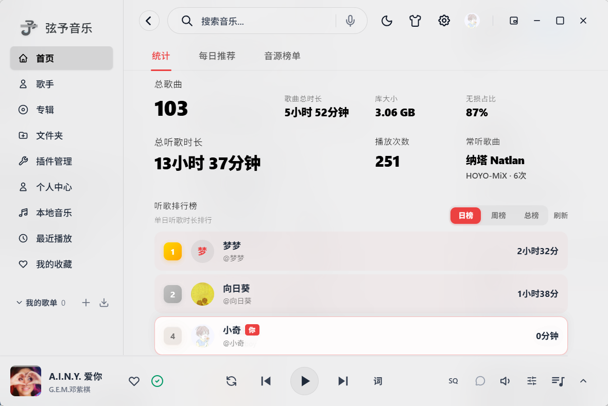
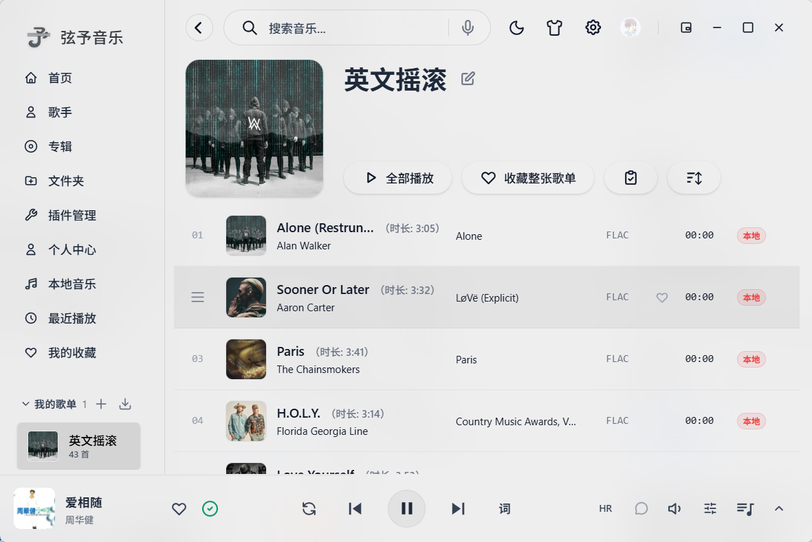
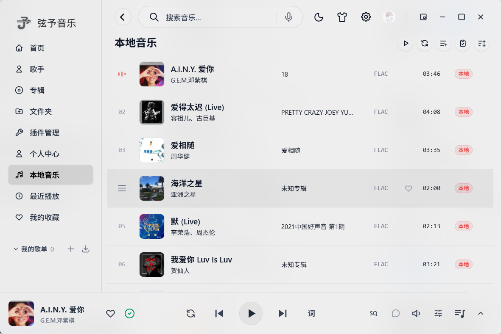
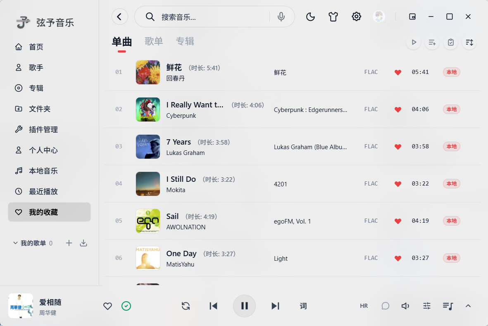
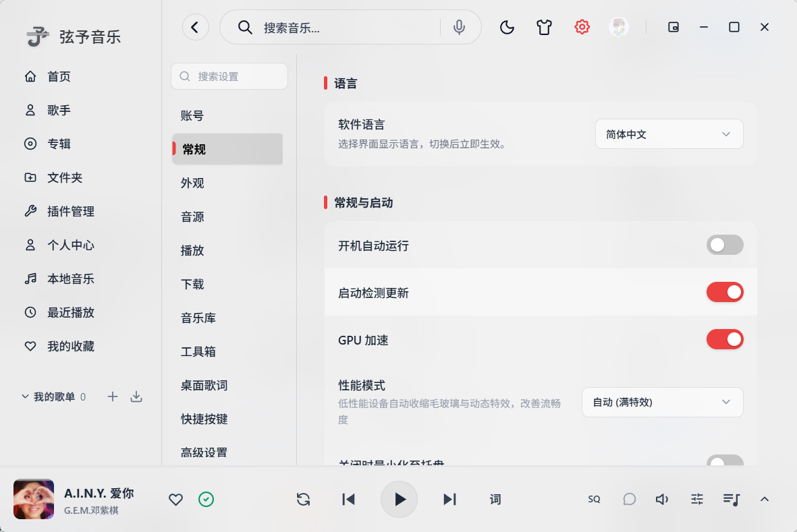
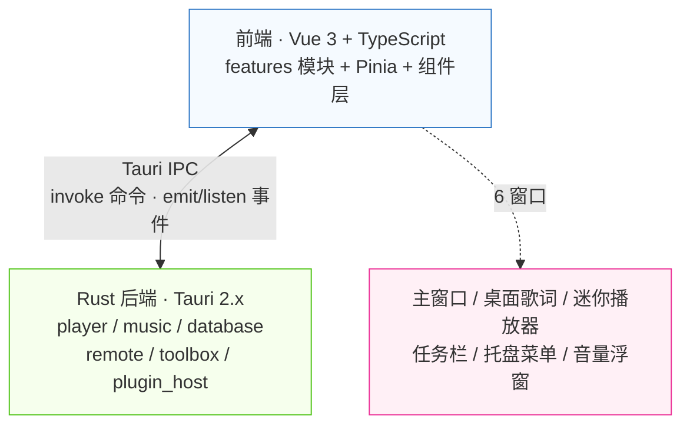

<div align="center">
  

# 弦予音乐· 桌面端
## (XianYu-Music-Desktop)

弦予音乐的桌面端（Windows / Linux / macOS）：本地音乐库管理 + 插件化音源扩展，**VST3 / CLAP 第三方音频插件机架**、液态玻璃 UI、AMLL 逐字歌词、桌面歌词、迷你播放器与任务栏控制条，桌面听歌的全功能形态。软件不内置音乐内容，插件由用户自行安装。

 [](https://tauri.app/)
 [](https://vuejs.org/)
 [](https://www.typescriptlang.org/)
 [](https://www.rust-lang.org/)
 [](https://tailwindcss.com/)

[](https://github.com/TaXiaoQi/XianYu-Music-Desktop/commits/dev)
 [](https://github.com/TaXiaoQi/XianYu-Music-Desktop/stargazers)
 [](https://github.com/TaXiaoQi/XianYu-Music-Desktop/graphs/contributors)
 [](./LICENSE)

</div>

## ✨ 功能亮点

- 🎨 **高颜值沉浸式 UI**
  
  - **动态背景系统**：提供类似 Apple Music 的液态网格渐变效果，背景颜色可根据当前播放曲目的专辑封面色彩动态演变，同时支持静态模糊与自定义用户皮肤。
  - **MV 电影模式**：插件 MV（B 站等）可作播放页动态视频背景，360P~4K 画质可选（默认档可设），音画频谱自动对齐起播偏移，MV 自带音轨可接管，流式缓冲边下边播。
  - **毛玻璃与美学视觉**：使用高度精致的半透明磨砂设计，与操作系统原生环境完美融合。
  - **响应式界面排版**：经典侧边栏导航，搭配“抽屉式”播放队列设计，提供极佳的交互体验。
- 🚀 **深度性能优化**
  
  - **秒开防白屏**：深度定制的主窗口冷启动主题色骨架屏，避免任何初始白屏闪烁。
  - **敏捷资源加载**：基于路由的懒加载机制与异步组件挂载，保障界面交互始终保持极高帧率。
  - **安全并发控制**：在 Rust 后端扫描大型音乐库时，采用信号量（Semaphore）对元数据和封面处理进行节流，有效抑制 CPU 突发飙升。
- 🛠️ **系统原生整合**
  
  - **系统级集成**：完美支持系统媒体通知控制（Windows SMTC / Linux MPRIS / macOS 控制中心）、Windows 媒体按键响应以及系统托盘快速操作。
  - **无缝本地管理**：提供高性能的本地音频文件扫描、标签元数据读取和物理文件重命名与整理，CUE 整轨自动分割入库。
  - **高级交互体验**：自研智能边界检测的上下文菜单，禁用浏览器默认右键行为，提供真正的原生应用质感。
  - **桌面歌词悬浮窗**：轻量化、高性能的桌面浮窗歌词，支持锁定、穿透与自定义样式。
  - **听歌识曲**：顶部栏一键识别正在播放的外部歌曲，识别结果直达播放。
  - **DLNA 投屏**：自动发现局域网渲染设备，一键投放到电视 / 音箱。
  - **应用内自更新**：启动自动检查新版本并引导安装，商店版自动交由商店接管。
- 🎛️ **VST3 / CLAP 第三方插件机架**
  
  - **专业插件即插即用**：自动扫描系统 VST3 / CLAP 插件目录（Windows 含 `Program Files\Common Files` 标准路径），第三方混响、EQ、压缩等效果器直接挂进音频引擎。
  - **机架式串联**：多槽位按顺序串联进播放链，参数实时调节 + 配置持久化；Windows 支持弹出插件原生编辑器窗口。
- 📝 **歌词解析与文件管理**
  
  - **全格式歌词**：支持音频文件内嵌标签歌词、同名 `.lrc` 文件解析，以及基于 AMLL 的歌词逐字动画渲染，支持歌词点击跳转进度与音译显隐开关；自定义歌词替换规则（错字 / 谐音修正）。
  - **物理整理与库更新**：内置文件夹管理模式，支持批量重命名预览、外部音频标签编辑器与无感入库刷新。
  - **音频工具箱**：设置内集成音频剪辑与格式转换工具。
- 🎛️ **内置音效与播放控制**
  
  - **专业音频调节**：内置多段均衡器（EQ）、变调变速、空间音效与重低音增强，支持跳过首尾静音段。
  - **灵活播放队列**：队列拖拽重排与「下一首播放」插播，音质不可用自动切换档位，在线播放失败自动在其他音源搜索同一首歌，播放不中断。
- 🔌 **音源插件生态**
  
  - **应用内插件市场**：官方插件目录检索与一键安装，支持插件订阅更新与第三方插件备份导入（MusicFree / 洛雪 / BakaMusic 等）。
  - **WebDAV 远程音库**：挂载 WebDAV 远程目录，远程曲库扫描、流式播放与预缓存。
- ☁️ **账号、云同步与内容**
  
  - **多端数据同步**：歌单、收藏、设置、插件跨设备同步，冲突提供智能处理策略。
  - **每日推荐与听歌报告**：基于听歌记录的个性化日推，逐曲展示推荐理由，内置听歌统计报告。
  - **音源榜单与热搜**：内置榜单页动态加载各源官方排行榜；顶栏搜索框热搜词一键直达。
  - **歌曲评论**：评论区聚合网易云 / QQ / 酷狗 / 酷我 / 咪咕 / 汽水六大平台评论，插件评论兜底。
  - **歌曲下载与分享**：音质 / 格式 / 保存路径可选下载，标签封面自动嵌入；歌曲一键生成分享链接。
  - **外部歌单导入**：M3U 播放列表与网易云 / QQ / 酷我 / 酷狗歌单链接直导（兼容 lx / MusicFree 歌单格式），支持从源端拉取更新对比增删。
  - **效率与备份**：桌面迷你小窗、全局媒体快捷键、多套主题预设；JSON 备份导入导出；应用内一键反馈（可附运行日志）、公告通知与首次启动引导。

---

## 📸 界面截图

| <br/>首页 | <br/>播放页 |
|:---:|:---:|
| <br/>歌单页 | <br/>本地音乐 |
| <br/>收藏页 | <br/>设置 |

---

## 🛠️ 使用源码构建运行

### 环境要求

| 依赖项 | 要求 |
| --- | --- |
| **Node.js** | `>= 18` |
| **Rust** | Stable 最新版 |
| **Windows** | WebView2 运行时（Win11 内置） |
| **Linux** | `libwebkit2gtk-4.1-dev`、`build-essential`、`curl`、`wget`、`libssl-dev`、`libgtk-3-dev`、`libayatana-appindicator3-dev`、`librsvg2-dev`、`libasound2-dev`（Ubuntu/Debian 包名） |
| **macOS** | Xcode Command Line Tools（`xcode-select --install`）+ `rustup target add aarch64-apple-darwin x86_64-apple-darwin` |

### 运行与调试

```bash
git clone https://github.com/ShenYichenCN/XianYu-Music-Desktop.git
cd XianYu-Music-Desktop
npm install

npm run tauri dev    # 桌面端开发调试
npm run dev          # 仅浏览器调试前端
```

### 构建各平台安装包

- **内置 ffmpeg sidecar**：仓库已附带 Windows 版产物（`src-tauri/bin/ffmpeg-x86_64-pc-windows-msvc.exe`，约 4.7MB 精简版 audio-only ffmpeg），正常 Windows 打包无需额外步骤。仅当产物缺失或需要重编时运行（自动引导便携 MSYS2 与工具链，全程约 20-40 分钟）：

```bash
powershell -ExecutionPolicy Bypass -File scripts\ffmpeg\build-audio-ffmpeg.ps1    # 产物自动落到 src-tauri/bin/，-Force 强制重编
```

- `tauri build` 对 `externalBin`（内置 ffmpeg）强校验，`src-tauri/bin/ffmpeg-<target-triple>` 缺失会直接报错；当前仓库附带 Windows x64 与 Linux x64（gnu）产物，mac 侧产物由 CI 构建时自动拉取，Windows ARM64（`ffmpeg-aarch64-pc-windows-msvc.exe`）需从 [BtbN Builds](https://github.com/BtbN/FFmpeg-Builds/releases) 下载 `winarm64` 版放入

```bash
npm run tauri build              # Windows 官网版（.exe，x64）
npm run tauri:build:arm64        # Windows ARM64 版（骁龙 X / Surface 等设备，脚本自动补齐交叉编译工具链 PATH）
npm run tauri:build:store:msix   # Windows 微软商店版（MSIX，与官网版互不影响）
npm run tauri:build:linux        # Linux（.deb / .rpm / .AppImage）
npm run tauri:build:mac          # macOS（.app / .dmg）
```

- 产物自动归档到 `releases/<平台>/`：`弦予音乐v<版本>-<平台>-<架构>.<扩展名>`（如 `弦予音乐v2.0.4-Desktop-X64.exe` / `弦予音乐v2.0.4-Desktop-ARM64.exe`，架构取自 Tauri 产物名，版本号取自 `version.ts`）
- ARM64 交叉编译为一次性环境投入：VS Installer 安装「MSVC v143 ARM64 生成工具」与「C++ CMake 工具」组件 + 安装 [LLVM](https://github.com/llvm/llvm-project/releases)（ring 依赖 clang-cl），`tauri:build:arm64` 会自动补齐 PATH
- MSIX 版通过 `store-build` 特性禁用应用内自更新（商店接管），版本号必须为纯数字四段正式版，Identity 与 Partner Center 配置绑定勿改
- macOS 分发需签名与公证，未签名包首次打开右键绕过 Gatekeeper

---

## 📐 技术架构

弦予音乐采用 Tauri 2.x 驱动的前后端分离架构，前端 Vue 3 负责 UI 渲染与状态管理，Rust 后端负责音频引擎、数据库、文件扫描等高性能计算，两者通过 Tauri IPC（命令式 `invoke` + 事件式 `emit/listen`）进行跨进程通信。



### 前端架构

采用 **Feature-based 模块化** 设计，每个功能领域自包含 Store + Composable + 辅助逻辑，而非按技术层分目录：

> 播放与音乐库领域的权威实现位于 `src/features/playback/`、`src/features/library/`。`src/composables/player*.ts` 仅保留少量旧路径兼容再导出，新增业务逻辑和测试应优先落在 `features/`，避免重构中间态继续扩散。

| 层级 | 说明 |
| --- | --- |
| **入口 `main.ts`** | 创建 Vue 应用，安装 Pinia + Router；通过 `getCurrentWindow().label` 分发到 6 个窗口的独立渲染逻辑；三重错误捕获 + 动态导入失败自动刷新恢复 |
| **路由 `router/`** | 11 条懒加载路由（首页 / 收藏 / 最近 / 歌手 / 专辑 / 插件 / 设置 / 认证 / 搜索 / 插件详情 / 引导），含 onboarding 路由守卫 |
| **功能模块 `features/`** | 13 个自包含模块：`playback`（播放+音效双 Store）、`library`（音乐库 songPool + intern pool 高性能设计）、`settings`（全局设置中心）、`collections`（收藏歌单）、`desktopLyrics` / `miniPlayer` / `taskbarPlayer` / `tray`（窗口纯逻辑模块）、`download` / `auth` / `onlineDetail` / `lyricsSettings` / `statistics` |
| **共享 Store `shared/stores/`** | 跨功能状态：`ui`（面板可见性）、`navigation`（导航/搜索历史）、`audioExport`（导出进度） |
| **组件 `components/`** | 按域划分：`layout`（Shell/侧边栏/底栏/标题栏）、`player`（播放详情/歌词/可视化/队列）、`settings`（15 个设置面板）、`overlays`（右键菜单/弹窗）、`home` / `song-list` / `statistics` |
| **服务层 `services/`** | `pluginEngine`（MusicFree 插件引擎，82KB）、`lxPluginEngine`（落雪插件引擎）、`tauri/`（API 封装）、`downloadService` |
| **构建优化** | Vite 手动分包：`vendor-vue` / `vendor-pixi`（流光背景）/ `vendor-amll`（AMLL 歌词）/ `vendor-utils` / `vendor-tauri`；WASM + TopLevelAwait 插件支持 |

### 后端架构

Rust 后端由多个业务模块组成，通过 `src-tauri/src/lib.rs` 集中注册 `#[tauri::command]`。命令数量随功能迭代变化较快，实际可调用清单以 `tauri::generate_handler![...]` 中的注册项和 `src-tauri/capabilities/*.json` 的权限分组为准。

| 模块 | 职责 | 关键技术 |
| --- | --- | --- |
| **`player/`** | 音频播放引擎 | 单音频线程 + mpsc 命令通道；8 层 Source 链（BufferedSource → VolumeNormalizer → Equalizer → SoundEffect → PluginHost → UserVolume → ClipGuard → TimedSource）；WASAPI 独占模式 + cpal 共享模式双后端；无锁可视化环形缓冲（AtomicU32）；vendored rodio 定制 100ms 缓冲 |
| **`player/sound_effect/`** | 30+ 种音效 DSP | 变调变速（OLA）、10 段 EQ（Biquad 级联）、Freeverb + 卷积混响、3D/8D/36D 环绕、压缩/限制/激励器/LoFi；Mutex + dirty flag 非阻塞音频线程同步 |
| **`player/plugin_host/`** | VST3 / CLAP 第三方插件机架 | truce-rack 宿主（VST3 + CLAP 双格式）；系统插件目录自动扫描；Rack 多槽位串联 + 参数持久化；Windows 原生编辑器窗口 |
| **`music/`** | 音乐库管理 | rayon 并行增量扫描（mtime/size diff）；lofty + symphonia 双引擎标签解析；CUE 整轨分割；封面双级缓存（150px + 800px，LRU 4GB） |
| **`database/`** | SQLite 数据持久化 | WAL 模式 + NORMAL 同步；14 张表（songs / artists / song_artists / play_history / song_stats / daily_stats / song_loudness / remote_sources ...）；增量迁移 |
| **`remote/`** | 远程音源 | WebDAV PROPFIND/GET（quick-xml）；流式缓存（SHA256 命名，LRU 5GB）；播放 50% 预缓存整曲 |
| **`toolbox/`** | 工具箱 | reqwest 流式下载（进度事件）；音频元数据嵌入；更新检查；文件重命名（tags/rules/auto）；听歌识曲（内置 MD5 + 酷狗指纹接口） |

### IPC 通信与插件系统

**双通道 IPC**：命令式 `invoke()`（180+ 个自定义命令，覆盖播放/库/统计/窗口/插件/下载全场景）+ 事件式 `emit/listen`（多窗口实时状态同步，含 Ready 握手 → State 推送 → State Applied 确认 → Action 回传完整协议）。

**双格式插件引擎**：同时兼容 MusicFree 与 LX 落雪两种插件格式，所有插件 HTTP 请求通过 Rust 后端 `plugin_http_request` 代理（绕过 WebView CORS），自动处理 Cookie 注入、图片代理（Referer 伪装）、插件云端同步。

### 多窗口架构

6 个窗口共享同一前端应用，通过 `window.label` 路由到不同组件：

| 窗口 | 用途 | 特性 |
| --- | --- | --- |
| `main` | 主窗口完整界面 | 无边框透明，1200×800 |
| `desktop-lyrics` | 桌面歌词悬浮窗 | 置顶 + 穿透 + 自定义样式 |
| `mini-player` | 迷你播放器 | 置顶 + 启动预热 |
| `taskbar-player` | 任务栏播放控制条 | Win32 `WS_EX_NOACTIVATE` 不抢焦点 + Z 序守护 |
| `tray-menu` | 系统托盘菜单 | 智能定位 + 子菜单展开方向检测 |
| `volume-popover` | 迷你播放器音量浮窗 | 独立浮窗 + 与迷你播放器联动 |

### 技术栈

| 层级 | 技术 |
| --- | --- |
| **前端** | Vue 3.5 (Composition API)、Vite 6、TypeScript 5.6、Tailwind CSS 4.0、Pinia 3、Vue Router 4、AMLL（Apple Music 风格歌词）、PixiJS（流光背景）、TanStack Virtual（虚拟列表） |
| **后端** | Rust (edition 2021)、Tauri 2.x、rodio 0.20（vendored 定制）、cpal 0.15、symphonia 0.5、lofty 0.21、rusqlite 0.38（bundled SQLite）、souvlaki 0.7（SMTC 系统媒体控制）、rustfft 6.4、reqwest 0.12、wasapi 0.23（独占模式） |
| **数据库** | SQLite（WAL 模式，14 张表，增量迁移） |
| **构建工具** | Vite 6 + WASM 插件、vitest（前端测试）、cargo test（Rust 测试）、NSIS（Windows 安装包） |

---

## 💝 特别致谢 

- **[Lycia Player](https://github.com/Billy636/LyciaMusic)**：本项目的UI设计、基础技术框架、本地播放引擎均由原项目实现。特此向其作者及所有贡献者致以最诚挚的谢意！

---


## ⚖️ 许可与资产声明

- **开源协议**：本项目基于 **AGPL-3.0-only** 许可协议开源，完整协议内容及歌词改编归属说明请分别参阅 [LICENSE](LICENSE) 与 [NOTICE](NOTICE)。
- **资产版权**：本项目内包含的所有视觉资产（包括但不限于应用 Logo、插图、截图等）均属原作者[Billy636](https://github.com/Billy636)个人及弦予开发团队（后称原团队）所有。未经原团队明确授权，请勿将这些图片资产用于任何商业用途或二次分发。

---

*更新日期：2026-09-25*
