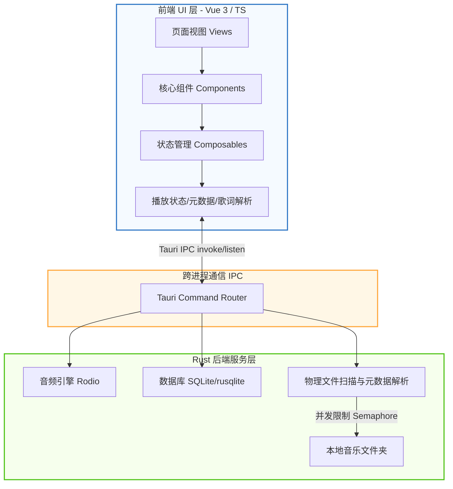

<div align="center">
  

# 弦予音乐
(XianYue-Music)

一款基于 **[Lycia Player](https://github.com/Billy636/LyciaMusic)** 修改构建的现代化、高颜值在线音乐播放框架，支持插件化在线音乐、本地音乐等播放功能,拥有良好的音乐播放体验。

 [](https://tauri.app/)
 [](https://vuejs.org/)
 [](https://www.typescriptlang.org/)
 [](https://www.rust-lang.org/)
 [](https://tailwindcss.com/)

[](https://github.com/TaXiaoQi/XY-Music-Desktop/commits/dev)
 [](https://github.com/TaXiaoQi/XY-Music-Desktop/stargazers)
 [](https://github.com/TaXiaoQi/XY-Music_Desktop/graphs/contributors)
 [](./LICENSE)

</div>

## ✨ 功能亮点

- 🎨 **高颜值沉浸式 UI**
  
  - **动态背景系统**：提供类似 Apple Music 的液态网格渐变效果，背景颜色可根据当前播放曲目的专辑封面色彩动态演变，同时支持静态模糊与自定义用户皮肤。
  - **毛玻璃与美学视觉**：使用高度精致的半透明磨砂设计，与操作系统原生环境完美融合。
  - **响应式界面排版**：经典侧边栏导航，搭配“抽屉式”播放队列设计，提供极佳的交互体验。
- 🚀 **深度性能优化**
  
  - **秒开防白屏**：深度定制的主窗口冷启动主题色骨架屏，避免任何初始白屏闪烁。
  - **敏捷资源加载**：基于路由的懒加载机制与异步组件挂载，保障界面交互始终保持极高帧率。
  - **安全并发控制**：在 Rust 后端扫描大型音乐库时，采用信号量（Semaphore）对元数据和封面处理进行节流，有效抑制 CPU 突发飙升。
- 🛠️ **系统原生整合**
  
  - **系统级集成**：完美支持系统媒体通知控制、Windows 媒体按键响应以及系统托盘快速操作。
  - **无缝本地管理**：提供高性能的本地音频文件扫描、标签元数据读取和物理文件重命名与整理。
  - **高级交互体验**：自研智能边界检测的上下文菜单，禁用浏览器默认右键行为，提供真正的原生应用质感。
  - **桌面歌词悬浮窗**：轻量化、高性能的桌面浮窗歌词，支持锁定、穿透与自定义样式。
- 📝 **歌词解析与文件管理**
  
  - **全格式歌词**：支持音频文件内嵌标签歌词、同名 `.lrc` 文件解析，以及基于 AMLL 的歌词逐字动画渲染。
  - **物理整理与库更新**：内置文件夹管理模式，支持批量重命名预览、外部音频标签编辑器与无感入库刷新。

---

## 📸 界面截图

### 核心界面

| 🎵 首页概览 | 💿 沉浸式播放页 |
| --- | --- |
|  |  |

<details>
<summary>📂 点击展开查看更多功能截图</summary>

### 媒体库与文件管理

| 📂 文件夹视图 | ⚙️ 文件夹管理模式 |
| --- | --- |
|  |  |

### 歌单、统计与辅助功能

| 🎶 歌单页面 | 📊 听歌历史统计 |
| --- | --- |
|  |  |

### 设置与个性化

| 🔧 常规设置 | 📦 音乐库设置 |
| --- | --- |
|  |  |

### 外置功能集成

| 🔗 支持 Lyricify 歌词集成 |
| --- |
|  |

</details>

---

## 🛠️ 使用源码构建运行

### 环境要求

| 依赖项 | 推荐版本 / 要求 |
| --- | --- |
| **Node.js** | `>= 18` |
| **Rust** | Stable 稳定版最新版本 |
| **操作系统** | Windows 10 / 11 |
| **WebView2** | 确保系统已安装 WebView2 运行时 (Windows 11 默认内置) |

### 运行与构建步骤

1. 克隆本仓库：
  
  ```bash
  git clone https://github.com/Billy636/LyciaMusic.git
  cd LyciaMusic
  ```
  
2. 安装依赖项：
  
  ```bash
  npm install
  ```
  
3. 启动 Tauri 桌面端开发调试：
  
  ```bash
  npm run tauri dev
  ```
  
4. 仅在浏览器中调试前端页面：
  
  ```bash
  npm run dev
  ```
  
5. 构建生产环境安装包：
  
  ```bash
  npm run tauri build
  ```
  

---

## 📐 技术架构

Lycia Player 采用经典的前后端分离架构，通过 Tauri 提供的 IPC 通道进行高性能的跨进程通信：



- **前端技术栈**：Vue 3 (Composition API)、Vite、TypeScript、Tailwind CSS 4.0
- **后端技术栈**：Rust、Tauri v2.0、SQLite (通过 `rusqlite` 实现音乐库高性能索引)
- **音频播放引擎**：基于 `rodio` 库的底层控制

---

## 💝 特别致谢 

- **[Lycia Player](https://github.com/Billy636/LyciaMusic)**：本项目的UI设计、基础技术框架、本地播放引擎均由原项目实现。特此向其作者及所有贡献者致以最诚挚的谢意！

---


## ⚖️ 许可与资产声明

- **开源协议**：本项目基于 **AGPL-3.0-only** 许可协议开源，完整协议内容及歌词改编归属说明请分别参阅 [LICENSE](LICENSE) 与 [NOTICE](NOTICE)。
- **资产版权**：本项目内包含的所有视觉资产（包括但不限于应用 Logo、插图、截图等）均属原作者[Billy636](https://github.com/Billy636)个人及弦予开发团队（后称原团队）所有。未经原团队明确授权，请勿将这些图片资产用于任何商业用途或二次分发。

---

*更新日期：2026-07-28*
